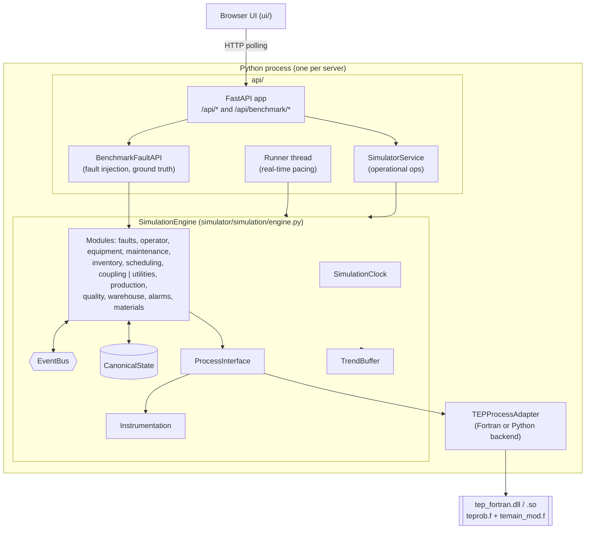
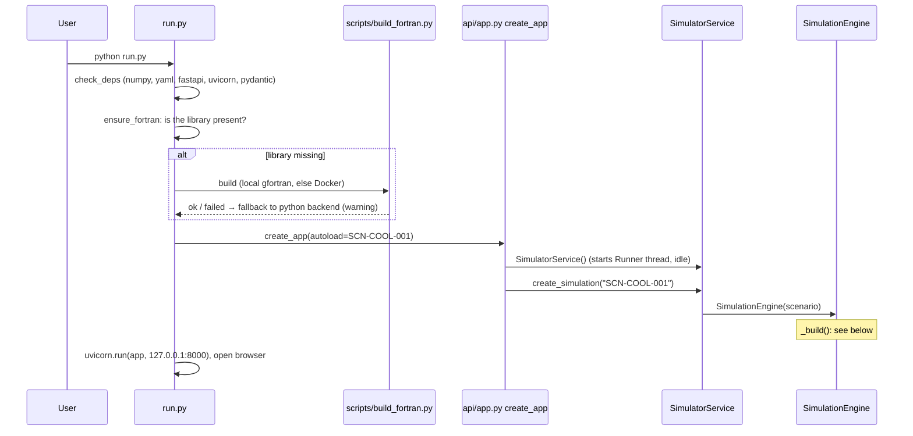
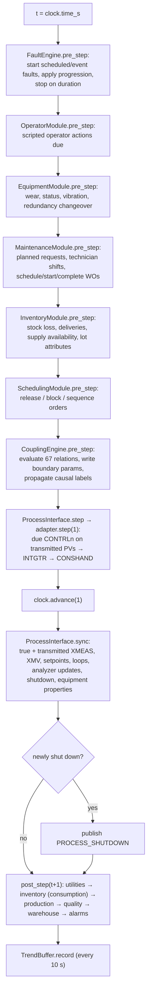
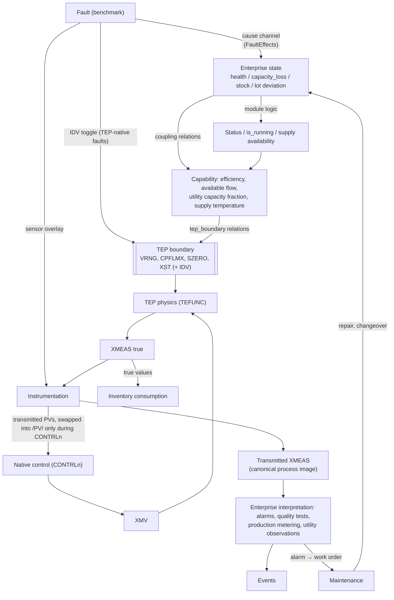
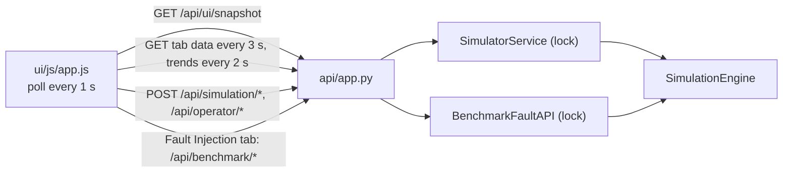

# Architecture

This page traces how the system is assembled and how a simulation evolves, as implemented. The
meaning of what it produces is defined in the [canonical contract](../CANONICAL_SIMULATOR_CONTRACT.md).

## 1. Overall architecture

**Layers and what they own:**

| Layer | Owns | Must not |
|---|---|---|
| TEP (Fortran) | process states, measurements, controller internals | — (never modified) |
| `TEPProcessAdapter` | calling TEP correctly: init, stepping, control schedule, boundary access, shutdown detection | contain enterprise logic |
| `ProcessInterface` | the enterprise side's only access to the adapter; syncs the process image | compute physics |
| Modules | their own enterprise state | reach into other modules' internals |
| `CanonicalState` | the in-memory truth for everything | — |
| `SimulatorService` / REST | operational API | fault injection (that is `BenchmarkFaultAPI`) |
| UI | presentation | hold simulation state |

## 2. Startup sequence

`python run.py` runs `run.main`:

`SimulationEngine._build()` does this, in order:

1. Validate the scenario and merge `config_overrides` over `configs/*.yaml` (`assemble_config`), then
   hash the result (`configuration_hash`).
2. Create the clock from `simulation_start`, load the ISA-95 hierarchy (`Hierarchy.from_config`) and
   the TEP mapping (`TEPMapping.from_config`). Both validate and fail fast.
3. Create `CanonicalState`, `EventBus`, `RandomStreams(seed)`, `Instrumentation` and `ProcessInterface`.
4. Register every ISA-95 element as an entity (`_register_hierarchy`).
5. Derive the TEP seed (`RandomStreams.tep_seed`, unless the scenario sets `tep_seed`) and initialize
   TEP (`ProcessInterface.initialize`). This zeroes the Fortran common blocks, calls TEINIT, sets the
   seed, loads the native controller parameters and records the TEINIT boundary values as "nominal".
6. Construct the modules and register operator commands.
7. Call `setup()` on each module in this order: equipment, utilities, materials, inventory, warehouse,
   production, scheduling, quality, maintenance, alarms, coupling (validates relations and evaluates
   them once to record baselines), faults (creates scenario faults), operator.
8. Build the trend buffer (166 series), run a t = 0 observation pass (utilities, warehouse, alarms) and
   record the first trend sample. Status becomes `READY`.

## 3. Simulation step lifecycle

The step is identical whether driven by the UI runner, `step_simulation`, `run_until` or a test.

Consequences of this order that matter when reading results:

* **One-second lag in coupling observations.** The coupling engine runs before the TEP step and reads
  the process image of the previous step. For example, `UT-CW-REACTOR.flow` is computed from last
  second's XMV(10).
* **Enterprise changes take effect in the same step.** A boundary parameter written in `pre_step(t)` is
  used by TEFUNC in the integration from t to t+1.
* **Events carry the time of the phase that raised them.** Pre-step events get time t and post-step
  events get time t+1.

## 4. End-to-end causal flow (as implemented)

The conceptual flow "fault → equipment → capability → coupling → TEP → measurements → control → XMV →
enterprise interpretation → production/quality/maintenance" is broadly right. The implementation
differs from it in five ways:

How it differs from the conceptual flow:

1. **Three separate entry points into TEP.** Enterprise faults go through coupling, TEP-native faults
   toggle IDV directly, and sensor faults act through the controllers without changing physics.
2. **Capability comes partly from module logic.** For example, a FAILED status sets `is_running = 0`
   in `EquipmentModule`, and a relation reads `is_running`.
3. **Two views of the measurements.** The enterprise layer reads *transmitted* values for alarms,
   quality, production and utility observations, but uses *true* feed flows for inventory consumption
   (`InventoryModule.post_step`).
4. **Maintenance closes a loop** back into enterprise state. It never acts on TEP directly.
5. **XMV is not interpreted by enterprise modules except in coupling observations.** Examples are the
   utility flow and power-demand relations, and saturation alarms on control-module outputs.

## 5. API and UI relationship

The UI holds no simulation state; it renders what the API returns. Service methods that read engine
state take the same re-entrant lock as the runner, so they never see a half-finished step. The exception
is `get_simulation_state` (`GET /api/simulation`), which reads without the lock: a status poll can
observe values from two different steps. `/api/ui/snapshot` calls it inside the lock.

Source:
- `run.py` — `main`, `ensure_fortran`, `check_deps`
- `api/app.py` — `create_app`
- `api/service.py` — `SimulatorService`, `Runner`
- `simulator/simulation/engine.py` — `SimulationEngine._build`, `SimulationEngine._step_once`, `SimulationEngine._register_commands`
- `simulator/simulation/process_interface.py` — `ProcessInterface.initialize`, `ProcessInterface.sync`
- `simulator/tep/interface.py` — `BaseTEPAdapter.step`
