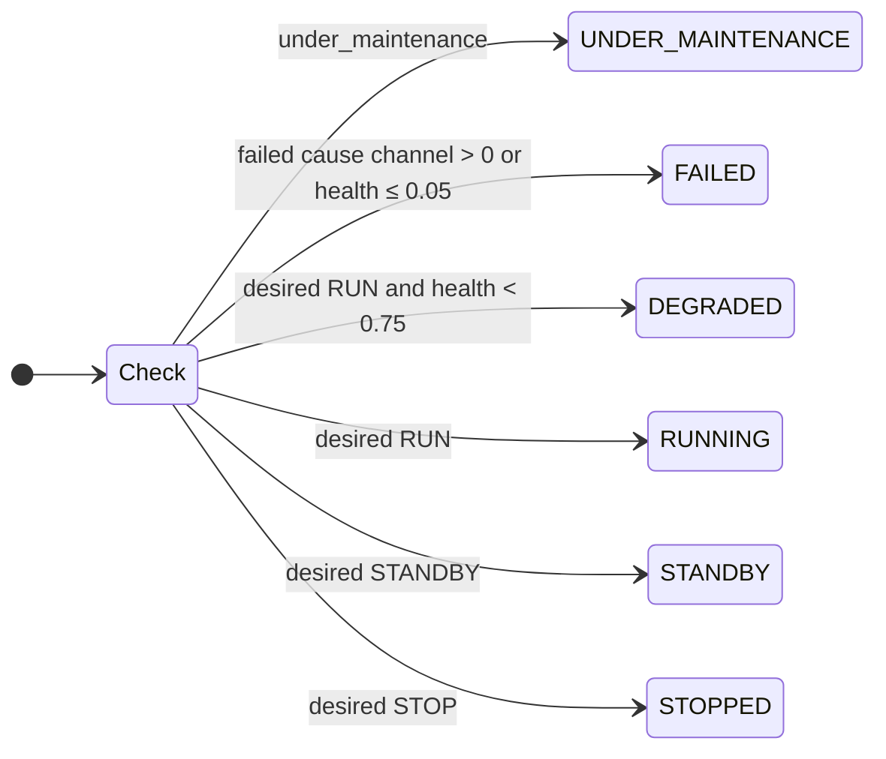

# Equipment

## What it represents

The physical machines whose condition matters: 4 cooling-water pumps, 1 cooling tower, 1 boiler,
1 transformer, 1 motor control centre, and two TEP machines (recycle compressor K-101 and reactor
agitator M-101). In `configs/equipment.yaml` these 10 are *assets*. All other ISA-95 elements (vessels,
valves, loops) have no condition model. Vessels and valves are represented only by the TEP variables
bound to them.

## Why it exists

Real faults start in equipment, not in process variables. Equipment condition turns a benchmark cause
("pump P-101A is wearing") into capability ("it can deliver 35 % of its flow"). Coupling then turns
that capability into a process constraint.

## State owned (`EquipmentModule`, per asset)

| Property | Meaning | Kind |
|---|---|---|
| `health` | 0..1, `intrinsic_health − damage` (damage = fault cause channel) | simulation truth (tagged `model_internal`) |
| `status` | RUNNING, DEGRADED, STANDBY, STOPPED, FAILED, UNDER_MAINTENANCE | enterprise interpretation |
| `is_running` | 1.0 if RUNNING or DEGRADED | simulated state, read by coupling |
| `desired_state` | RUN / STANDBY / STOP (operator command, changeover, maintenance) | command |
| `role` | duty / standby / single | interpretation |
| `vibration` | `1.8 + 10·(1−health)²` mm/s plus N(0, 0.05) while running; 0 when stopped | **observable** condition indicator |
| `run_hours` | accumulates while running | simulated |
| `rated_*` | ratings from config | constant |
| `efficiency` | pumps, compressor, boiler, tower: computed by coupling. Transformer, MCC, agitator: a 1.0 placeholder never updated | see [variable reference](../05_state_and_events/variable_reference.md) |

### Status resolution (`EquipmentModule._resolve`, every second)

Rules are evaluated top to bottom. Thresholds come from `configs/equipment.yaml` defaults
(`degraded: 0.75`, `failed: 0.05`).

## Inputs

* Fault cause channels on the asset: `damage`, `failed` (read here), `efficiency_loss` (read by
  coupling).
* `MAINTENANCE_STARTED` / `MAINTENANCE_COMPLETED` events for this asset.
* Operator command `equipment_command {asset_id, state}` → `EquipmentModule.command`.
* Seeded random stream `equipment` (wear noise, vibration noise).

## Behaviour

* **Natural wear while running:** each second `intrinsic_health -= max(rate_per_h·dt + σ·N(0,1)·√dt, 0)`
  with dt = 1/3600 h (default rate 0.0002/h, σ = 0.00005/√h; P-101A 0.0004/h). Wear over 3 h is ≈ 0.001,
  negligible in the demo. Health never increases except by repair.
* **Redundancy groups** RG-CW-REACTOR (P-101A duty, P-101B standby) and RG-CW-CONDENSER (P-201A/B). If
  no member is running and a STANDBY member exists, the healthiest one is started after 30 s
  (`_redundancy`). This covers failures only; a *degraded* duty pump keeps running, so a
  degradation does not trigger changeover.
* **Maintenance start** (corrective or planned): the asset is isolated (`UNDER_MAINTENANCE`, desired
  STOP). If it was running and a standby exists, the standby starts immediately (planned changeover).
  If there is no standby (cooling tower, boiler, transformer, MCC, compressor, agitator), the asset is
  simply out of service for the duration, and coupling then removes its capability.
* **Maintenance completion:** intrinsic health is set to `restore_health` (e.g. 0.98), and all
  `damage` / `efficiency_loss` / `failed` cause contributions on the asset are cleared
  (`FaultEffects.clear_target`). The asset returns as STANDBY if another group member runs, otherwise
  RUN. `EQUIPMENT_REPAIRED` is published and the fault engine marks the cleared faults remediated.

## Outputs

* Properties above → read by coupling relations (`health`, `is_running`, `rated_*`) and alarms
  (`vibration`, `status`).
* Events: `EQUIPMENT_STATE_CHANGED` (on every status change), `EQUIPMENT_DEGRADED` (each time health
  enters the POOR band, 0.05 < health < 0.75), `EQUIPMENT_FAILED`, `EQUIPMENT_REPAIRED`.

## What it does NOT control

It does not compute efficiency, flow, capacity or any TEP input; those are coupling relations. It does
not decide *when* maintenance happens; that is `MaintenanceModule`. It never touches TEP.

## Which assets can affect TEP

| Asset | Path to TEP | Boundary parameter |
|---|---|---|
| WU-CWP-101A/B | pump flow → reactor CW capacity | `reactor_cw_max_flow` (VRNG 10) |
| WU-CWP-201A/B | pump flow → condenser CW capacity | `condenser_cw_max_flow` (VRNG 11) |
| WU-CT-101 | tower performance → supply temperature | `reactor_/condenser_cw_inlet_temperature_mean` (SZERO 5/6) |
| WU-BLR-301 | steam available → stripper steam | `stripper_steam_valve_range` (VRNG 9) |
| WU-TX-401, WU-MCC-401 | power → MCC supply → pumps, tower, boiler, compressor | indirectly, several |
| EM-COMPRESSOR | efficiency × margin × running × power | `compressor_max_flow` (CPFLMX) |
| EM-AGITATOR | **none**: TEP's agitator term cannot represent a weakened drive | — |

## Instrumentation (sensor layer)

`simulator/equipment/instrumentation.py` sits between TEP and everyone else. It holds sensor overlays:
bias, drift (units per hour × elapsed time), dropout (hold the last value and flag it BAD) and stuck
(hold without flag). `Instrumentation.filter` produces transmitted values. `ProcessInterface.sync`
stores them as `process.xmeas` together with a per-channel quality flag. The native controllers receive
the filtered values (see [native control](../03_tep/native_control.md)). The `stuck` kind is supported
by the class, but no fault type creates it.

Source:
- `configs/equipment.yaml`
- `simulator/equipment/__init__.py` — `EquipmentModule`, `EquipmentModule._resolve`, `EquipmentModule._redundancy`, `EquipmentModule._on_maintenance_started`, `EquipmentModule._on_maintenance_completed`, `EquipmentModule.command`
- `simulator/equipment/instrumentation.py` — `Instrumentation.filter`, `Instrumentation.observe`
- `tests/test_enterprise.py` — `test_failure_changeover_and_maintenance_recovery`, `test_equipment_degradation_propagates_through_coupling_to_tep`
