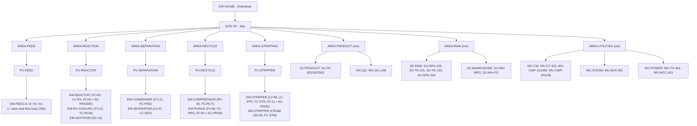

# ISA-95 model

The site is structured with the ISA-95 (IEC 62264-1) role-based equipment hierarchy, as used by OPC UA
for ISA-95 (OPC 10030). The full 87-element table (ids, parents, levels, state, variables, observed
events) is generated in [isa95_entity_table.md](isa95_entity_table.md).

## Levels and containment rules implemented

`simulator/isa95/__init__.py` defines 14 levels (`EquipmentLevel`) and the allowed parent→child pairs
(`ALLOWED_CHILDREN`). `Hierarchy.validate` rejects any other containment, duplicate ids, cycles, and
anything but a single Enterprise root (tests: `test_hierarchy_is_valid`,
`test_hierarchy_rejects_invalid_containment`, `test_hierarchy_rejects_duplicates_and_bad_levels`).

| Parent | Allowed children |
|---|---|
| Enterprise | Site |
| Site | Area |
| Area | ProcessCell, ProductionUnit, ProductionLine, StorageZone, WorkCenter |
| ProcessCell | Unit |
| Unit | EquipmentModule, ControlModule |
| ProductionUnit | Unit, EquipmentModule, ControlModule |
| ProductionLine | WorkCell |
| WorkCell / StorageUnit / WorkUnit | EquipmentModule, ControlModule |
| StorageZone | StorageUnit |
| WorkCenter | WorkUnit |
| EquipmentModule | EquipmentModule, ControlModule |
| ControlModule | ControlModule |

The model *defines* ProcessCell, Unit, ProductionLine and WorkCell, but **no element of the current
site uses them**. The levels in use are Enterprise 1, Site 1, Area 8, ProductionUnit 5, StorageZone 3,
StorageUnit 9, WorkCenter 4, WorkUnit 9, EquipmentModule 13 and ControlModule 34.

## Modelling choices (not ISA-95 requirements)

| Choice | Why | Where ISA-95 is simplified |
|---|---|---|
| TEP areas use **Production Units**, not Process Cells/Units | TEP is continuous; Process Cell/Unit is the batch pattern | Production Units directly contain Equipment Modules (no Unit level in between); ISA-95 allows lower-level equipment here |
| Five TEP areas: Feed, Reaction, Separation, Recycle & Purge, Stripping | follows the Downs & Vogel flowsheet (feeds, reactor, condenser+separator, compressor+purge, stripper) | purge is grouped with the compressor, not its own area |
| Control loops are **Control Modules** placed under the EM of their final control element (XMV loops) or of their PV (cascade masters) | makes loops navigable next to the equipment they act on | ISA-95 does not prescribe where loops sit |
| Analyzer loops (AC-RFA/D/E, AC-PRGB, AC-PRDE) are ControlModules nested **inside** the analyzer ControlModule | ControlModule → ControlModule is allowed | — |
| Utilities are **WorkCenter / WorkUnit** | ISA-95 has no utility-specific level | Utility *services* (UT-*) are not ISA-95 elements at all; they are separate entities of kind `utility` |
| Storage and warehouse use StorageZone/StorageUnit | standard pattern | spare parts are not ISA-95 elements (records in `spare_parts`) |
| QC lab is a WorkCenter/WorkUnit | lab is a work center | — |
| TEP variables are **not** equipment | variables are data on equipment | bound in `configs/tep_mapping.yaml` (`test_every_variable_is_mapped_and_is_not_equipment`) |
| Every element carries `origin: TEP` or `ENTERPRISE` | shows what exists in the original process model and what this layer invented | 57 TEP, 30 ENTERPRISE |

Materials, production, maintenance and quality are ISA-95 **operations** concepts (Part 3/4 activity
models). They are *not* represented as equipment. They exist as module state and records: material
lots, production orders and lots, work orders, quality samples. There is no ISA-95 personnel, physical
asset or segment model; technicians are plain records.

## Hierarchy

Notes on the generated table:

* The product analyzer AT-11 (XMEAS 37-41) sits under the **stripper** (`EM-STRIPPER`) because it
  samples stream 11 leaving the stripper. The "Product Storage and Quality Area" contains only
  enterprise elements.
* `CM-FIC-PRD` (loop 11, product flow) is under the **condenser**, because its final control element
  is the condenser CW valve XMV(11). This follows the native Braatz scheme.

Source:
- `configs/site.yaml`
- `simulator/isa95/__init__.py` — `Hierarchy`, `EquipmentLevel`, `Hierarchy.validate`
- `simulator/isa95/tep_mapping.py` — `TEPMapping`
- `tests/test_model.py` — `test_hierarchy_is_valid`
