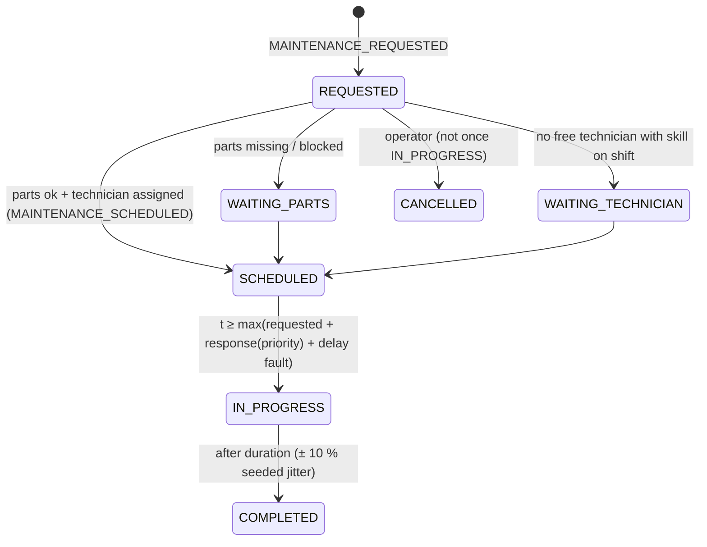

# Maintenance

## What it represents

A maintenance organisation: work orders, four technicians with skills and shifts, spare parts, and
response times. It is the main *recovery* mechanism of the simulator. Neither TEP nor the enterprise
layer repairs anything by itself.

## Why it exists

Recovery in a plant is organisational. Someone must notice, plan, get parts and do the work, and that
takes time. The demo outcome (recovery vs. trip) depends on this time ([intervention and
recovery](../06_scenarios/intervention_and_recovery.md)).

## How work orders are created

| Trigger | Kind | Priority | Where |
|---|---|---|---|
| Alarm whose definition has `maintenance: corrective` (e.g. pump vibration > 3.8 mm/s) | corrective on the alarmed asset | from `maintenance_priority` (2) | `MaintenanceModule._on_alarm` |
| Alarm with `maintenance: inspection` (e.g. CW utilization ≥ 0.97) | inspection on `maintenance_target` (WC-CW) | 2 | same |
| `EQUIPMENT_FAILED` on an asset | corrective | 1 | `_on_failure` |
| Scenario `planned_maintenance` | planned | from scenario | `pre_step` |
| Operator `request_maintenance` | as requested | as requested | `request` |

At most one open work order exists per asset. A new request for an asset with an open order returns
the existing one.

## Life cycle (`MaintenanceModule.pre_step`, every second)

* **Response time by priority** (`configs/maintenance.yaml`): P1 600 s, P2 1500 s, P3 3600 s, P4 14400 s.
  The `maintenance_delay` fault adds to it.
* **Technicians:** the first free one (by id) with the skill and on shift in simulated UTC hour. They
  are BUSY from assignment to completion, which includes the dispatch wait.
* **Parts** are reserved at SCHEDULED and issued at IN_PROGRESS (inventory module).
* **Corrective and planned** orders isolate the asset for their duration. **Inspection** orders do not.
  On completion they check every running asset under the inspected element and raise corrective
  orders for any with efficiency < 0.85 or health < 0.75.

## Effect on equipment and, through it, on TEP

At `MAINTENANCE_STARTED` the equipment module isolates the asset. If it was running and a standby exists,
it starts the standby immediately. At `MAINTENANCE_COMPLETED` it restores health and clears the fault
damage. **Maintenance never acts on TEP**; its effect reaches TEP only through the changed equipment
state and the coupling relations ([maintenance_to_tep](../04_coupling/maintenance_to_tep.md)).

## Worked examples

* **Demo (SCN-COOL-001).**
  1. Vibration alarm at 01:20:33 → WO-00001 (P2), scheduled with TECH-01.
  2. Start at 01:45:33 = request + 1500 s. P-101B starts and P-101A is isolated.
  3. Complete at 02:51:13 after the ≈ 60 min ± 10 % task.

  The inspection WO-00002 (from the CW capacity alarm) starts at 01:54:16 and finds nothing, because
  P-101A is no longer running.
* **Planned maintenance on a non-redundant asset (SCN-FAULT-LIBRARY, 6:00).** A P3 cooling-tower
  inspection starts about 1 h after request and isolates CT-101.
  1. Tower performance drops to 0, so the CW supply temperature rises 35 → 47 °C.
  2. TEP's inlet-temperature walk mean follows at its next knot.
  3. TC-RCW opens XMV(10) from about 41 % to 52 %.

  This was observed by running the scenario. It is modelled behaviour, not a configured fault.

## What it does NOT do

There is no automatic preventive maintenance: planned tasks come only from a scenario's
`planned_maintenance` list.
There is no cost model and no overtime. Work orders cannot be reassigned, and inspections do not
diagnose non-running assets.

Source:
- `configs/maintenance.yaml`
- `configs/alarms.yaml`
- `simulator/maintenance/__init__.py` — `MaintenanceModule.request`, `MaintenanceModule._plan`, `MaintenanceModule._complete`, `MaintenanceModule._inspect`, `MaintenanceModule._on_alarm`, `MaintenanceModule._on_failure`, `MaintenanceModule.cancel`
- `tests/test_enterprise.py` — `test_failure_changeover_and_maintenance_recovery`, `test_spare_part_shortage_blocks_work_order`
- `tests/test_reproducibility.py` — `test_demo_scenario_causal_chain`
