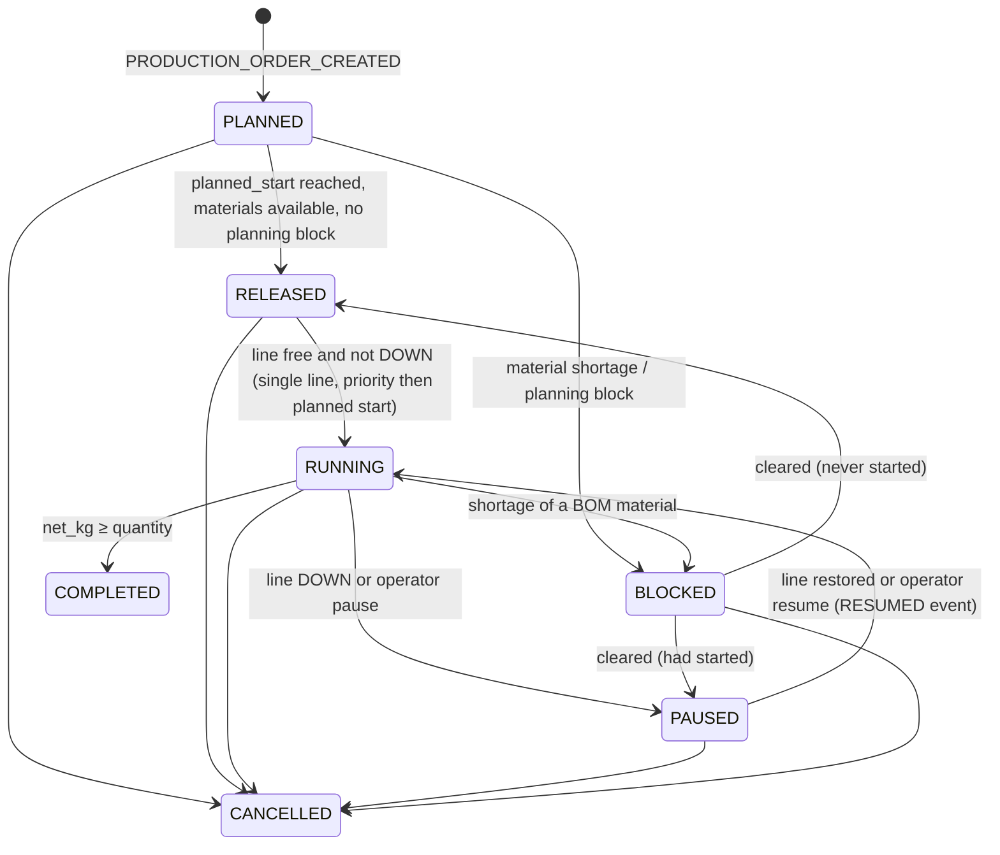

# Production and scheduling

## What it represents

The TEP line producing "G/H Product Mixture, Mode 1" (`PROD-GH-M1`), customer production orders, and
hourly production lots. Two modules: `ProductionModule` (line state, metering, lots, order progress,
KPIs) and `SchedulingModule` (order release, blocking, sequencing, lateness projection). They share the
order state machine in `simulator/production/orders.py`.

## Why it exists

It translates process behaviour into business consequences: rate, output, lots and late orders.

## Metering and line state (`ProductionModule.post_step`, every second)

* `rate_kg_h = transmitted XMEAS(17) [m3/h] × 613.4 kg/m3`, and 0 when the process is shut down. The
  density comes from the Downs & Vogel base case (14,076 kg/h at 22.949 m3/h), `configs/production.yaml`.
  It is a **metered** value: a bias on XMEAS(17) biases reported production. There is no separate
  "true" production.
* A 5-minute exponential average classifies the line:
  * **DOWN:** shut down, or below 5 % of nominal.
  * **REDUCED_RATE:** below 90 % of nominal.
  * **RUNNING:** otherwise.

  Changes publish `PRODUCTION_STATE_CHANGED`.
* **Production lots** (`PL-0001`, …) open when the line is not DOWN. A lot closes (→ AWAITING_QC) when
  it has run for 3600 s, when the running order changes or completes, or when the line goes DOWN.
* The running order accumulates `produced_kg`, and its net quantity is `produced_kg − rejected_kg`.
  When net ≥ quantity the order is COMPLETED.
* **KPIs** in `state.production.oee`:
  * availability = run time / elapsed;
  * performance = produced / (nominal × run time), capped at 1 in OEE;
  * quality = accepted / (accepted + rejected), counting only decided lots.

## Order state machine

Transitions not in `TRANSITIONS` raise `ValueError`, which the API returns as HTTP 400
(`test_production_order_state_machine`).

**Material check.** A BOM material counts as short when its storage unit's `supply_availability < 1`.
Order release publishes the material requirement (BOM × remaining quantity), which the inventory module
reserves.

**Projection.** Every second the scheduler projects each open order's end time from the smoothed
production rate and flags `late` if it is past `planned_end`. Lateness is a flag only, with no event.

## Interactions

| Reads | Writes | Events |
|---|---|---|
| transmitted XMEAS(17), process shutdown, `LOT_STATE_CHANGED` (quality decisions), storage `supply_availability`, fault channels `release_delay_s` / `blocked` | `state.production`, production lots and orders | PRODUCTION_ORDER_*, PRODUCTION_STATE_CHANGED, LOT_STATE_CHANGED (IN_PROCESS, AWAITING_QC) |

**What it does NOT control:** production never influences TEP. Feed consumption is inventory, and
production rate is whatever TEP's product flow controller delivers. Orders do not change setpoints.

## Worked example (demo)

Both orders complete (PO-2026-0201 at 01:25:10, PO-2026-0202 at 02:51:07). The cooling fault does not
stop production: the rate stays near nominal except a short REDUCED_RATE period at 01:59:13-01:59:39,
during recovery. The fault's business impact is on quality (a quarantined lot), not quantity.

Source:
- `configs/production.yaml`
- `simulator/production/__init__.py` — `ProductionModule.post_step`, `ProductionModule._open_lot`, `ProductionModule._close_lot`, `ProductionModule._update_kpis`
- `simulator/production/orders.py` — `transition`, `order_from_config`, `ProductionOrder`
- `simulator/scheduling/__init__.py` — `SchedulingModule.pre_step`, `SchedulingModule._project`, `SchedulingModule.command`
- `tests/test_enterprise.py` — `test_production_order_state_machine`, `test_order_blocked_by_material_shortage`
