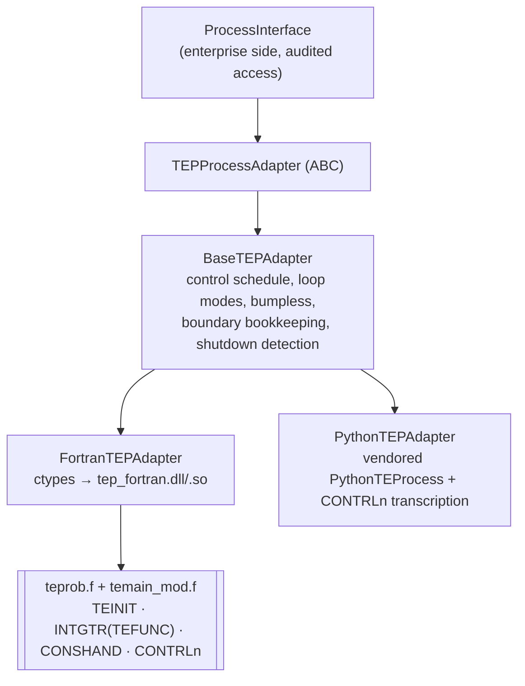

# TEP integration

## Layers

## Adapter interface (`simulator/tep/interface.py`)

| Operation | Meaning |
|---|---|
| `initialize(tep_seed)` / `reset()` | zero the common blocks, call TEINIT, set G, load native controller configuration |
| `step(n, measurement_filter)` | n × (due controllers on filtered PVs → INTGTR → CONSHAND → shutdown check) |
| `get_measurements()` / `get_manipulated_variables()` / `get_states()` / `get_disturbances()` | copies of XMEAS(41), XMV(12), YY(50), IDV(20) |
| `set_manipulated_variable(i, v)` | only if the owning loop is not running; clamped to 0-100 |
| `set_disturbance(i, on)` | IDV flag |
| `get_time()` / `get_time_seconds()` | TEP TIME in hours / step count |
| `is_shutdown()` / `get_shutdown_reason()` | latched interlock state |
| `get/set_control_mode`, `set_loop_mode`, `get_loop_modes`, `get_setpoints`, `set_setpoint`, `get_loop_states` | native control access |
| `get_boundary_parameters()` / `set_boundary_parameter(name, v)` | the 17 boundary parameters (clamped to declared min/max) |
| `version_info()` | backend, seed, library and source hashes |

## Fortran backend details

* **Library:** `simulator/tep/fortran/lib/tep_fortran.dll` on Windows (`libtep_fortran.so` on Linux,
  `.dylib` on macOS). `TEP_FORTRAN_LIB` overrides the path.
* **Common blocks** are mapped with ctypes `Structure`s declared field by field: `PV`, `TEProc` (580
  doubles + 12 ints), `Wlk`, `CtrlAll`, and `CtrlP`/`CtrlPI` for each loop. The numpy views of
  XMEAS/XMV/SETPT write straight into Fortran memory.
* **Several simulations in one process.** Common blocks are process-global, so a second concurrent
  adapter loads a **private copy** of the library from a temp directory with a unique file name. The
  first adapter uses the original file. The temp copies are not deleted.
* **Initialisation** (`_native_init`) zeroes every common block and the YY/YP arrays, then calls TEINIT.
  This matters: TEFUNC uses the previous TCR/TCS/TCC/TCV as Newton initial guesses in TESUB2, and
  TEINIT does not reset them, so without zeroing a re-initialisation would differ in the last bits.
  The determinism tests found this.
* **Seed:** TEINIT sets G = 4651207995. The adapter overwrites `/RANDSD/ G` afterwards with the scenario
  TEP seed, which must be non-zero mod 2³².

## Python backend details (development only)

The physics is the vendored `PythonTEProcess`; a fresh instance is created on every initialisation.
The controllers are a statement-by-statement transcription of CONTRLn, including the CONTRL6 override.
It is **not bit-identical** to Fortran: the port does not reproduce REAL-literal rounding inside
`teprob.f`. `test_python_backend_statistically_matches_fortran` checks key means over 20 minutes agree
within 1 %. `run.py` falls back to it, with a warning, when no library can be built.

## Boundary between TEP and the enterprise layer

Everything that crosses it: [coupling contract](../04_coupling/coupling_contract.md).

## Timing

* One step is 1 s of simulated time. TEP TIME advances by the single-precision DELTAT, 2.7777778e-4 h.
  That is 1.0000000162 s, so TEP TIME and step count diverge by about 0.2 ms per hour.
* Analyzer results update when TEP's internal TGAS/TPROD timers fire: every 0.1 h for feed and purge,
  every 0.25 h for product. `ProcessInterface.sync` detects new results by comparing the true analyzer
  values with the previous step's.

Source:
- `simulator/tep/interface.py` — `TEPProcessAdapter`, `BaseTEPAdapter`
- `simulator/tep/fortran_backend.py` — `FortranTEPAdapter`, `FortranTEPAdapter._native_init`, `FortranTEPAdapter._load`, `TEProc`
- `simulator/tep/python_backend.py` — `PythonTEPAdapter`
- `simulator/tep/__init__.py` — `create_adapter`, `available_backends`
- `simulator/simulation/process_interface.py` — `ProcessInterface`
- `tests/test_tep_adapter.py` — `test_fortran_is_deterministic_and_seed_dependent`, `test_python_backend_statistically_matches_fortran`
