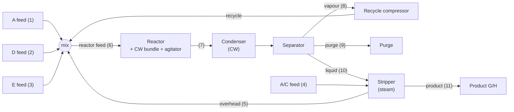

# TEP overview

## What TEP is

The Tennessee Eastman Process (Downs & Vogel, 1990/1993) is a published model of a real chemical plant,
built as a control and fault-detection benchmark. Four gaseous reactants (A, C, D, E) and an inert (B)
produce two liquid products G and H, plus a by-product F:

```
A(g) + C(g) + D(g) → G(liq)        A(g) + C(g) + E(g) → H(liq)
A(g) + E(g) → F(liq)               3 D(g) → 2 F(liq)
```

Five unit operations: reactor, product condenser, vapour-liquid separator, recycle compressor and
product stripper. The model has 50 states, 41 measurements, 12 manipulated variables and 20
disturbances.



## What this simulator uses

| Part | Origin | Role here |
|---|---|---|
| `teprob.f`: TEINIT, TEFUNC, TESUB1-8 | Downs & Vogel code (revised 1991) | process physics, measurement noise, disturbances, shutdown logic |
| `temain_mod.f`: CONTRL1-22, INTGTR, CONSHAND | Russell, Chiang & Braatz (UIUC, 1998-2002) | closed-loop control and Euler integration. The MAIN program is compiled but never executed |
| Downs & Vogel base case | paper | reference values for measurements (`catalog._XMEAS_BASE`) and the production density |

It runs in **Mode 1** (50/50 G/H by mass), the operating point TEINIT initialises. Other modes are
not configured.

## What TEP gives the enterprise layer

* 41 **measurements**: [measurements.md](measurements.md) (generated table).
* 12 **manipulated variables**: [manipulated_variables.md](manipulated_variables.md).
* 20 **disturbances**: [disturbances.md](disturbances.md).
* 19 **native control loops**: [native_control.md](native_control.md), [native_control_loops.md](native_control_loops.md).
* **Shutdown** when interlock limits are exceeded: [safety_and_shutdown.md](safety_and_shutdown.md).
* 17 **boundary parameters** the enterprise layer may set: [boundary_variables.md](../04_coupling/boundary_variables.md).

Source:
- `simulator/tep/fortran/src/teprob.f`
- `simulator/tep/fortran/src/temain_mod.f`
- `simulator/tep/catalog.py`
