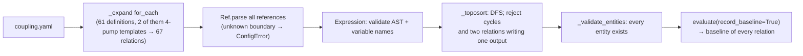

# Coupling architecture

## Purpose

Coupling is how enterprise state becomes a physical constraint on the process, without inventing
physics and without writing TEP outputs. It is implemented as a **declarative causal model**
(`configs/coupling.yaml`) evaluated by `CouplingEngine`.

## The relation model

A relation is `output = expression(inputs)`:

```yaml
- id: CR-CW-RX-TEP
  category: tep_boundary
  inputs: {nominal: tep.nominal.reactor_cw_max_flow, frac: UT-CW-REACTOR.capacity_fraction}
  output: tep.boundary.reactor_cw_max_flow
  expression: "nominal * frac"
```

| Reference syntax | Resolves to | Can be output? |
|---|---|---|
| `ENTITY.property` | canonical-state entity property | yes |
| `process.XMEAS(n)` / `process.XMV(n)` | **transmitted** XMEAS / XMV from the last sync | no |
| `tep.boundary.<name>` | current boundary value (cached in `ProcessInterface`) | yes. **The only way into TEP** |
| `tep.nominal.<name>` | TEINIT value recorded at initialisation | no |
| `fault.<TARGET>.<channel>` | combined fault cause contribution | no |

`for_each` expands a template for several entities (`{id}` substitution). Expressions are parsed with a
whitelisted AST: arithmetic, comparisons, conditionals, and the functions min, max, abs, clip, interp,
ramp, step, safe_div, sqrt, exp, log, sum, round and float. There is no attribute access, subscripting
or builtins (`Expression`).

## Start-up (`CouplingEngine.setup`)



## Every step (`CouplingEngine.pre_step` → `evaluate`)

For each relation in topological order:

1. Read the inputs.
2. Evaluate the expression.
3. Write the output. An entity property is written directly. A boundary parameter goes through
   `ProcessInterface.set_boundary`, which writes to TEP only if the value changed and stores the
   clamped value.
4. Propagate causal labels ([causal semantics](../07_variable_graph/causal_semantics.md)).

This runs **after** the enterprise pre-step modules and **before** the TEP step. Process references
therefore see the previous second's transmitted values.

## Relation categories (all 67; generated list in [coupling_relations.md](coupling_relations.md))

| Category | Count | What it expresses | Example |
|---|---|---|---|
| `equipment_performance` | 15 | condition → capability | pump efficiency = health × (1 − efficiency_loss) |
| `power_distribution` | 1 | MCC supply | MCC supply fraction = process power fraction × MCC running |
| `utility_supply` | 12 | capability → utility capacity | reactor CW capacity = Σ pump available flow × (1 − capacity_loss) |
| `tep_boundary` | 15 | utility / storage / equipment → TEP boundary | VRNG(10) = nominal × capacity fraction |
| `utility_observation` | 24 | process values → utility observations | CW flow = XMV(10)/100 × VRNG(10) |

## Influence that is NOT in the relation model

Some enterprise influences are module code, not relations. They are still explicit, just not
configurable in `coupling.yaml`:

| Influence | Module | Why not a relation |
|---|---|---|
| fault `damage` → `health`; health/desired state → `status` → `is_running` | `EquipmentModule._resolve` | a state machine with thresholds and redundancy |
| stock → `supply_availability`; current lot → `*_deviation` | `InventoryModule._refresh_storage` | FIFO lots and quality status |
| alarm → work order; work order → isolation, changeover, repair | `MaintenanceModule`, `EquipmentModule` | discrete events |
| TEP-native fault → IDV | `_IDVFault.apply` | a TEP input of its own |
| sensor fault → transmitted value → controllers | `Instrumentation` + `BaseTEPAdapter.step` | acts on measurement transmission, not physics |

## What coupling never does

* **It never writes XMEAS, TEP states, XMV, SETPT or IDV.** The only TEP targets are the 17 boundary
  parameters.
* **It never computes a process variable.** Reactor temperature, pressure and composition come only
  from TEFUNC.
* **It never acts on alarms, events or orders.** Coupling produces values; modules publish events.

Source:
- `configs/coupling.yaml`
- `simulator/coupling/__init__.py` — `CouplingEngine.setup`, `CouplingEngine.evaluate`, `CouplingEngine._toposort`, `CouplingEngine._propagate_cause`, `Ref.parse`, `_expand`
- `simulator/common/expressions.py` — `Expression`
- `tests/test_enterprise.py` — `test_coupling_baseline_is_native_and_graph_is_acyclic`
