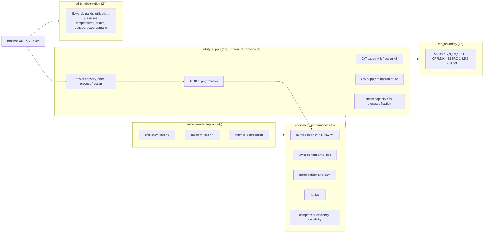

# Coupling graph

The coupling graph is the **executed** part of the variable graph. It is the dependency graph of the
67 relations in `configs/coupling.yaml`, built and topologically sorted by `CouplingEngine` at start-up.
`CouplingEngine.graph()` exposes it together with the documented `process_influences`. The UI shows
it as a list in the **Causal Model** tab, and `/api/benchmark/coupling` returns it.

## Structure

Two properties to notice:
* **One loop through the power model:** power process demand (which reads XMEAS 20) → process supply
  fraction → MCC supply → pump flow. It is not a cycle in the relation graph, because process values
  come from the previous step.
* **Observations are sinks.** Utility utilization feeds only status, alarms and, through maintenance,
  equipment.

## Validation at start-up

* **Cycles** are rejected, with the cycle path in the error (`_toposort`).
* **Two relations writing the same output** are rejected.
* **Unknown entities or boundary names** are rejected.
* **Relation baselines are recorded;** boundary baselines must equal TEINIT
  (`test_coupling_baseline_is_native_and_graph_is_acyclic`).

## Relation to the variable graph

The variable graph ([07_variable_graph](../07_variable_graph/graph_model.md)) contains all coupling
edges plus other kinds that are not executed as relations: TEP physics, native control, module logic
and discrete events. Only the coupling graph is evaluated by the simulator.

Source:
- `simulator/coupling/__init__.py` — `CouplingEngine.graph`, `CouplingEngine._toposort`
- `api/service.py` — `SimulatorService.get_coupling`
- `ui/js/panels.js` — `renderCausal`
