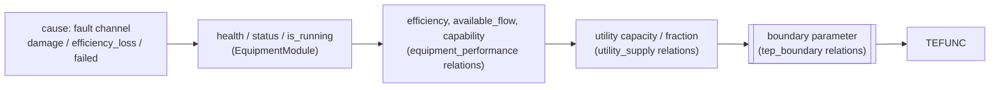

# Equipment → TEP

## The causal pattern

## Worked example: CW pump P-101A efficiency loss

A `pump_efficiency_loss` fault on WU-CWP-101A with severity 0.6 does **not** change XMEAS(9). Its
effect travels like this:

1. The fault writes `efficiency_loss = 0.6 × intensity` on the cause channel.
2. `CR-PUMP-EFFICIENCY[WU-CWP-101A]`: efficiency = health × (1 − 0.6). Health is unchanged, so there
   is **no vibration signature** and no condition-monitoring alarm. The fault is hidden by design.
3. `CR-PUMP-FLOW`: available flow = 1100 × efficiency × running × MCC supply.
4. `CR-CW-RX-CAPACITY` → `CR-CW-RX-FRACTION` → `CR-CW-RX-TEP`: VRNG(10) = 1000 × clip(flow/1000).
   With health 0.97 and loss 0.6: 1100 × 0.388 = 427, so VRNG(10) ≈ 427.
5. TEFUNC: less CW flow at the same valve opening → TWR (XMEAS 21) rises.
6. TC-RCW opens XMV(10). If the valve saturates, TC-RX can no longer hold XMEAS(9).
7. The first *observable* enterprise signals are UT-CW-REACTOR becoming DEGRADED and then
   CONSTRAINED, followed by the capacity alarm UA-CWRX-CAP. That alarm raises an **inspection** of
   WC-CW. The inspection finds P-101A (efficiency < 0.85 while running) and raises a corrective order.

The same pattern applies to `equipment_degradation` and `cooling_degradation` on a pump. Those reduce
`health`, which *does* raise vibration, so condition monitoring can see them.

## Equipment and the boundary each can reach

| Equipment | Relation chain | Boundary |
|---|---|---|
| P-101A/B | CR-PUMP-EFFICIENCY → CR-PUMP-FLOW → CR-CW-RX-CAPACITY → CR-CW-RX-FRACTION → CR-CW-RX-TEP | VRNG(10) |
| P-201A/B | … → CR-CW-COND-CAPACITY → CR-CW-COND-FRACTION → CR-CW-COND-TEP | VRNG(11) |
| CT-101 | CR-CT-PERFORMANCE → CR-CT-TEMPERATURE-RISE → CR-CW-RX/COND-SUPPLY-T → …-TEP | SZERO(5), SZERO(6) |
| B-301 | CR-BOILER-EFFICIENCY → CR-BOILER-STEAM → CR-STEAM-CAPACITY → CR-STEAM-FOR-PROCESS → CR-STEAM-FRACTION → CR-STEAM-TEP | VRNG(9) |
| K-101 compressor | CR-COMPRESSOR-EFFICIENCY → CR-COMPRESSOR-CAPABILITY → CR-COMPRESSOR-TEP | CPFLMX |
| TX-401, MCC-401 | via UT-POWER.process_supply_fraction and WU-MCC-401.supply_fraction into pumps, tower, boiler, compressor | several |
| Agitator M-101 | none | — |
| Feed storages SU-* (equipment of the enterprise layer) | module logic → CR-FEED-*-SUPPLY / CR-FEED-*-LOT | VRNG(1-4), XST, SZERO(1,2) |

## Failure vs degradation

| Cause | Equipment effect | TEP effect |
|---|---|---|
| `equipment_failure` on the duty pump | FAILED → `is_running = 0` → flow 0 | VRNG(10) = 0 for about 30 s, until auto-changeover starts the standby; then 1.0 again |
| degradation of the duty pump | DEGRADED, still running | VRNG(10) reduced continuously; **no** changeover until maintenance |

Source:
- `configs/coupling.yaml`
- `simulator/equipment/__init__.py` — `EquipmentModule._resolve`, `EquipmentModule._redundancy`
- `simulator/faults/types.py` — `PumpEfficiencyLoss`, `EquipmentDegradation`, `CoolingDegradation`, `EquipmentFailure`
- `simulator/maintenance/__init__.py` — `MaintenanceModule._inspect`
- `tests/test_enterprise.py` — `test_equipment_degradation_propagates_through_coupling_to_tep`, `test_failure_changeover_and_maintenance_recovery`
