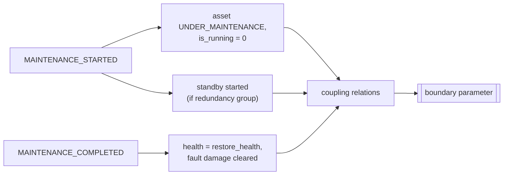

# Maintenance → TEP

Maintenance has **no direct path** into TEP. It changes equipment state, and the unchanged coupling
relations carry that change into boundary parameters.

## Three observed cases

| Case | Mechanism | Boundary effect | Evidence |
|---|---|---|---|
| **Corrective with standby** (demo, P-101A at 01:45:33) | P-101A isolated, P-101B started in the same event | reactor CW capacity jumps 0.382 → 1.0, so VRNG(10) goes back to 1000 within one step; `UTILITY_STATE_CHANGED` → NORMAL at 01:45:52 (the utilization threshold clears with the valve) | [demo trace](../06_scenarios/scenario_examples/SCN-COOL-001_trace.md) |
| **Planned maintenance without standby** (CT-101 in SCN-FAULT-LIBRARY, starts ≈ 25,200 s) | tower isolated, performance 0 | supply temperature 35 → 47 °C, so SZERO(5)/(6) rise; TC-RCW absorbs it (XMV(10) 41 → 52 %) | observed by running the scenario |
| **Failure repair** (P-201A in the test) | the failed pump was already replaced by an auto-changeover; the repair returns it as STANDBY | none at completion | `test_failure_changeover_and_maintenance_recovery` |

## Consequence for benchmark design

Two features of the model make isolating a non-redundant asset hurt the process:

* **The isolation is immediate** and lasts the whole task duration.
* **There is no "maintenance without isolation" mode** for corrective or planned work.

Scheduling planned work on CT-101, the boiler, the transformer, the MCC or the compressor is therefore
itself a process disturbance. Isolating the MCC removes power to every pump.

Source:
- `simulator/equipment/__init__.py` — `EquipmentModule._on_maintenance_started`, `EquipmentModule._on_maintenance_completed`
- `simulator/maintenance/__init__.py` — `WorkOrder.isolates_equipment`
- `scenarios/SCN-FAULT-LIBRARY.yaml`
