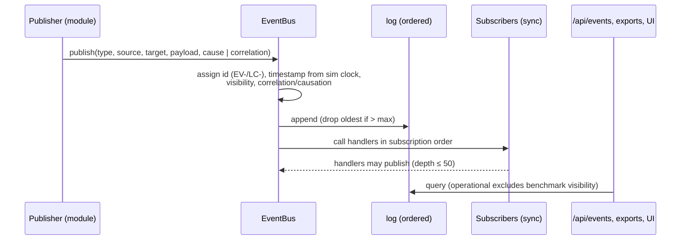
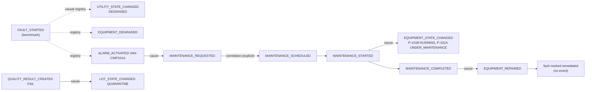

# Event lifecycle

## From condition to consumer

## Who subscribes to what

| Subscriber | Event types | Effect |
|---|---|---|
| EquipmentModule | MAINTENANCE_STARTED, MAINTENANCE_COMPLETED | isolate or changeover; repair |
| InventoryModule | PRODUCTION_ORDER_RELEASED, _COMPLETED, _CANCELLED; MAINTENANCE_SCHEDULED, _STARTED; LOT_STATE_CHANGED | reservations; parts; material lot status |
| ProductionModule | LOT_STATE_CHANGED | accepted/rejected kg; order net quantity |
| WarehouseModule | LOT_STATE_CHANGED | move lots between tanks |
| QualityModule | MATERIAL_RECEIVED | schedule incoming inspection |
| MaintenanceModule | ALARM_ACTIVATED, EQUIPMENT_FAILED | create work orders |
| FaultEngine | all events (event triggers); EQUIPMENT_REPAIRED | start event-triggered faults; remediate |

## Typical chains (observed in the demo)

Dotted edges are correlation through the causal registry. Solid edges are explicit `cause=` links.

## Ordering

Within a step, events appear in the order the modules run: faults, operator, equipment, maintenance,
inventory, scheduling, coupling (which publishes no events), then PROCESS_SHUTDOWN if any, then
utilities, inventory, production, quality, warehouse, alarms. An operator action publishes its specific
event first (e.g. SETPOINT_CHANGED) and then OPERATOR_ACTION.

## Retention

Events live in memory for the run. Reset creates a new bus, so the new run's log starts with
`SIMULATION_RESET` (`LC-`). Events are persisted only by export.

Source:
- `simulator/events/__init__.py` — `EventBus`
- `simulator/operator/__init__.py` — `OperatorModule.execute`
- `api/service.py` — `SimulatorService.reset_simulation`
