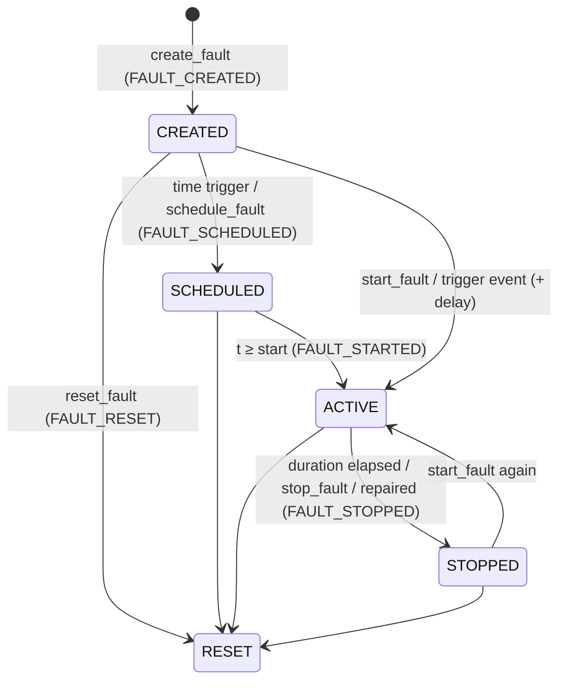

# Fault injection

> The benchmark controls the **cause**. The simulator determines the **consequences**.

## Defining a fault

```yaml
- id: F-COOL-001                     # unique
  type: cooling_degradation          # 34 types, see fault_taxonomy.md
  target: WU-CWP-101A                # validated against the type's target list
  trigger: {mode: simulation_time, time: 3600}   # | {mode: manual} | {mode: event, event_type: EQUIPMENT_FAILED, event_target: ..., delay_s: 0}
  severity: 0.62                     # 0..1; TEP-native types require 1.0
  progression: {mode: gradual, ramp_s: 1800}      # step | gradual | intermittent {period_s, duty}
  duration: 1800                     # seconds active; omit for open-ended
  parameters: {}                     # type specific
  direct_indication: false           # metadata only
  observability: {observable_via: [vibration]}   # metadata only
  expected_effects: [...]            # metadata only
  description: ...
```

`start_time` is accepted instead of `trigger.time`. `direct_indication`, `observability` and
`expected_effects` are **documentation for the benchmark**. They do not change behaviour, and defaults
come from the fault type.

## Life cycle (`FaultEngine`)



Every second while ACTIVE (`FaultEngine.pre_step`, the first module of the step):

* **intensity** = 1 for `step`; `min(1, elapsed / ramp_s)` for `gradual` (ramp defaults to the
  duration); a square wave of `period_s` and `duty` for `intermittent`;
* the type's `apply(engine, fault, intensity)` writes `severity × intensity` (scaled by parameters) to
  its cause channel, or toggles IDV, or updates a sensor overlay.

**Stop vs reset:**
* **stop** ends the cause. Non-persistent types remove their contributions and causal labels.
  **Persistent** types (`equipment_degradation`, `cooling_degradation`, `pump_efficiency_loss`,
  `equipment_failure`) keep their contribution frozen at its last value until a repair clears it.
* **reset** removes every contribution and label immediately, as if the cause never existed.

**Remediation.** When maintenance repairs an asset, the equipment module clears its damage,
efficiency-loss and failure contributions and lists the affected fault ids in `EQUIPMENT_REPAIRED`.
The fault engine marks those faults `remediated`. An active one is stopped with reason "remediated by
repair".

## Propagation

A fault never touches a consequence directly. The type determines the entry point
([fault taxonomy](fault_taxonomy.md)):

| Entry point | Types | Then |
|---|---|---|
| equipment cause channel | degradation, cooling, efficiency loss, failure | EquipmentModule → coupling → TEP boundary |
| utility cause channel | utility capacity loss, cooling (utility target) | coupling → boundary |
| material cause channel | quality deviation, shortage | InventoryModule → coupling → boundary; scheduling (blocked orders) |
| organisational cause channel | maintenance delay, spare part shortage, order delay, quality failure | maintenance / scheduling / quality modules only; no TEP effect |
| IDV | IDV1..IDV20 | TEFUNC directly |
| instrumentation overlay | sensor bias, drift, dropout | transmitted values → native controllers → real process response; alarms; quality; production |

## Ground truth

Ground truth is what the benchmark knows about **causes** that plant personnel could not directly
observe.

| Item | Where | Exposed by |
|---|---|---|
| Fault definitions, status, intensity, history | `collections["faults"]` | `/api/benchmark/faults*` only |
| Fault lifecycle events (FAULT_*) | event log, `visibility=benchmark` | `/api/benchmark/ground-truth` only; excluded from `/api/events` |
| Cause channels | `state.fault_effects` | `/api/benchmark/ground-truth` |
| Causal registry | `state.causal` | `/api/benchmark/ground-truth`; **and indirectly** via `correlation_id`/`causation_id` on operational events |
| Sensor overlays | `Instrumentation.overlays` | `/api/benchmark/ground-truth` |
| True XMEAS where it differs from transmitted | `process.xmeas_true` | **also** `/api/history` (`TRUE:XMEAS(n)`) and exports |
| IDV flags | `process.idv` | not returned by any operational route (the operational process image omits them) |
| Health, efficiency, boundary values, lot deviations | entity properties, `process.boundary` | **also** `/api/entities/*`, `/api/process/image`, `/api/coupling` |
| Everything above, in bulk | export bundle | **also** `/api/export/json` and `/api/export/csv`, which include all events (FAULT_* included) and the `faults` list |
| Fault definitions of the running scenario | `SimulatorService.current_scenario_with_faults` | **also** `/api/scenarios/current` |

The rows marked **also** are where ground truth reaches routes outside `/api/benchmark` today. See
[benchmark limitations](../11_limitations/benchmark_limitations.md) for the full analysis.

## API (benchmark only)

`create_fault`, `schedule_fault`, `start_fault`, `stop_fault`, `reset_fault`, `get_fault_status`,
`list_faults`, `catalog` on `BenchmarkFaultAPI`; REST under `/api/benchmark/faults…`
([benchmark API](../08_api/benchmark_api.md)). The UI's red **Fault Injection (benchmark)** tab uses
these routes.

Source:
- `simulator/faults/engine.py` — `FaultEngine`, `fault_from_spec`, `FaultEngine.create_fault`, `FaultEngine.start_fault`, `FaultEngine.stop_fault`, `FaultEngine.reset_fault`, `FaultEngine._intensity`, `FaultEngine._on_repaired`, `FaultEngine._on_event`
- `simulator/faults/types.py` — `FaultType`
- `simulator/faults/effects.py` — `FaultEffects`, `COMBINE`
- `tests/test_enterprise.py` — `test_fault_lifecycle_and_validation`, `test_fault_injection_is_deterministic`
