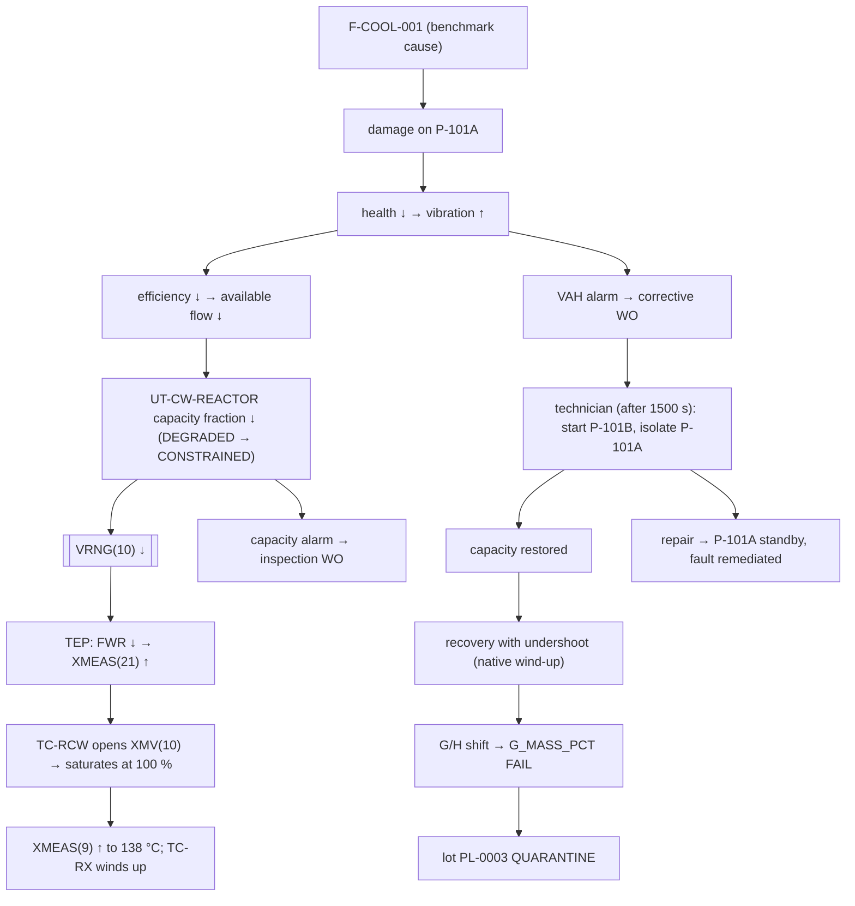

# Worked example: SCN-COOL-001, reactor cooling-water pump degradation

Scenario: `scenarios/SCN-COOL-001.yaml`, seed 18472, 3 h, Fortran backend. All times and values below
were observed by running it. The raw event log and the key values are in
[SCN-COOL-001_trace.md](SCN-COOL-001_trace.md), regenerated by `scripts/generate_docs_tables.py`.

## The cause (the only thing the benchmark sets)

```yaml
- id: F-COOL-001
  type: cooling_degradation      # on a pump → writes the 'damage' cause channel
  target: WU-CWP-101A            # reactor CW duty pump
  trigger: {mode: simulation_time, time: 3600}
  severity: 0.62
  progression: {mode: gradual, ramp_s: 1800}
  duration: 1800
```

## Step by step

| Time | Step | Subsystem | State variable | Event (visibility) | Graph edge (semantics) | TEP variable | Enterprise consequence |
|---|---|---|---|---|---|---|---|
| 01:00:00 | Fault starts; damage ramps 0 → 0.62 over 30 min | FaultEngine | `fault_effects[WU-CWP-101A, damage]` | FAULT_STARTED (benchmark) | fault damage → health (cause_injection) | — | causal registry: WU-CWP-101A → F-COOL-001 |
| 01:00+ | Pump health falls 0.97 → 0.348 | EquipmentModule | `WU-CWP-101A.health`, `.vibration` | — | health → efficiency (capability_constraint) | — | vibration rises (observable) |
| 01:00+ | Pump capability falls | CouplingEngine | `.efficiency`, `.available_flow` (1100 × eff) | — | efficiency → available_flow (capability_constraint) | — | — |
| 01:02:57 | CW capacity below design (flow < 1000 at health ≈ 0.909) | CouplingEngine, UtilitiesModule | `UT-CW-REACTOR.capacity_fraction` < 1, `status` DEGRADED | UTILITY_STATE_CHANGED (corr F-COOL-001) | available_flow → capacity → fraction (supply_dependency) | — | utility DEGRADED |
| 01:02:57+ | Boundary written | CouplingEngine → ProcessInterface | `process.boundary.reactor_cw_max_flow` | — | fraction → VRNG(10) (tep_boundary_interface) | **VRNG(10)** 1000 → 382 (minimum) | — |
| 01:03+ | Less cooling water at the same valve opening | **TEP** | — | — | VRNG(10) → XMEAS(21) (process_response) | FWR ↓ → TWR (XMEAS 21) ↑ | — |
| 01:03+ | Native cascade responds | **TEP native control** | `SETPT(10)` (TC-RX output) ↓, XMV(10) ↑ | — | XMEAS(21) → TC-RCW → XMV(10) (control_measurement / control_actuation); XMEAS(9) → TC-RX → TC-RCW (control_cascade) | XMV(10) 41 % → 76.5 % (01:23) | — |
| 01:10:34 | Health < 0.75 | EquipmentModule | `status` DEGRADED | EQUIPMENT_DEGRADED, EQUIPMENT_STATE_CHANGED (corr F-COOL-001) | — | — | pump DEGRADED |
| 01:20:33 | Vibration > 3.8 mm/s for 10 s | AlarmModule | alarm VAH-CWP101A ACTIVE_UNACK | ALARM_ACTIVATED (corr F-COOL-001) | vibration → work order (event_trigger) | — | — |
| 01:20:33 | Corrective work order created and scheduled (TECH-01, P2) | MaintenanceModule | WO-00001 SCHEDULED; parts reserved | MAINTENANCE_REQUESTED, MAINTENANCE_SCHEDULED | — | — | impeller SP-IMP-101 and seal kit reserved; purchase order raised for impellers (availability hit the reorder point) |
| 01:28:16 | Valve demands the whole supply (utilization ≥ 0.97) | CouplingEngine, UtilitiesModule | `utilization`, `status` CONSTRAINED | UTILITY_STATE_CHANGED | — | XMV(10) ≈ 98 % | utility CONSTRAINED |
| 01:28:50 | **Valve saturated** at 100 % | TEP (CONSHAND clamp) | `process.xmv[9]` = 100 | ALARM_ACTIVATED OUTH-L10 at 01:28:57 (30 s delay) | — | XMV(10) = 100 % until 01:45:40 | controller at its limit |
| 01:29:16 | Capacity alarm → inspection work order on WC-CW | AlarmModule → MaintenanceModule | WO-00002 | ALARM_ACTIVATED UA-CWRX-CAP, MAINTENANCE_REQUESTED | utilization → work order (event_trigger) | — | — |
| 01:30:00 | Fault duration ends: the cause stops, damage stays (persistent) | FaultEngine | fault STOPPED | FAULT_STOPPED (benchmark) | — | — | — |
| 01:31:35 | Reactor temperature > 122.5 °C | TEP → AlarmModule | alarm TAH-09 | ALARM_ACTIVATED (corr F-COOL-001) | — | **XMEAS(9)** rising; TC-RX output winding up | — |
| 01:45:33 | Technician starts corrective work: standby started, P-101A isolated | MaintenanceModule → EquipmentModule | P-101B RUNNING, P-101A UNDER_MAINTENANCE | MAINTENANCE_STARTED, EQUIPMENT_STATE_CHANGED ×2 | work order → is_running (state_transition) | — | spare parts issued |
| 01:45:40 | Peak | TEP | — | — | — | **XMEAS(9) 138.21 °C** (peak); TC-RCW setpoint −675.7 (wind-up minimum); pressure peak 2822 kPa (< 3000 trip) | — |
| 01:45:52 | Capacity restored | CouplingEngine, UtilitiesModule | capacity_fraction 1.0, NORMAL | UTILITY_STATE_CHANGED | — | VRNG(10) 1000 | — |
| 01:46–02:20 | Recovery with **undershoot**: TC-RCW first closes (XMV(10) 14 % at 01:46:40, a proportional reaction to the falling XMEAS 21), then the wound-up setpoint unwinds | TEP native control | — | ALARM_ACTIVATED TAL-09 at 02:04:05 | — | XMEAS(9) minimum 116.00 °C at 02:20:40 | — |
| 01:54:16 → 02:15:14 | Inspection of WC-CW; no findings (P-101A no longer running) | MaintenanceModule | WO-00002 COMPLETED | MAINTENANCE_STARTED, MAINTENANCE_COMPLETED | — | — | — |
| 02:15:01 | Product sample fails G_MASS_PCT (represents product made 02:00) | QualityModule | QS-00009 FAIL; lab `last_result_fail` | QUALITY_RESULT_CREATED (corr F-COOL-001); ALARM_ACTIVATED QA-OFFSPEC | XMEAS(40/41) → G_MASS_PCT (derivation) | XMEAS(40), (41) | off-spec alarm |
| 02:40:10 | Lot PL-0003 (01:25–02:25) disposed: 1 of 4 samples failed (25 %) | QualityModule → WarehouseModule | lot QUARANTINE, stays in TK-501 | LOT_STATE_CHANGED (corr F-COOL-001) | test → lot disposition (state_transition) | — | ≈ 14.2 t quarantined |
| 02:51:13 | Repair complete: P-101A health 0.98, returns as STANDBY | MaintenanceModule → EquipmentModule | WO-00001 COMPLETED; damage cleared | MAINTENANCE_COMPLETED, EQUIPMENT_REPAIRED | work order → health (state_transition) | — | fault F-COOL-001 marked remediated |
| 03:00:00 | End: **recovery incomplete** | TEP | — | SIMULATION_COMPLETED | — | XMEAS(9) 118.68 °C (SP 120.4); TC-RCW SP 60.2 (initially 94.6) | both orders COMPLETED; no shutdown |

## The whole chain



## What to take from it

* **Only the first box was set by the benchmark.** Nothing downstream of `damage` was written by the
  fault engine.
* **Native control first absorbs the constraint** (01:03–01:28) and then fails at saturation. The
  temperature rise comes from TEP, not from a rule.
* **The quality failure is caused by the controller's wind-up undershoot after the repair**, not by the
  high-temperature excursion itself. The samples representing 01:30 and 01:45 passed.
* **The outcome depends on maintenance timing.** With dispatch blocked, the same fault trips the plant
  on reactor pressure at 01:54:09 ([intervention and recovery](../intervention_and_recovery.md)).
* **Every consequence event carries correlation `F-COOL-001`.** That is ground truth, useful for
  scoring and leaked to operational consumers today.

Tests that assert this chain: `test_demo_scenario_causal_chain` (event order, correlation ids, T > 130
°C, XMV(10) ≥ 99.9 %, no shutdown, recovery state, work order completed, quality failure, lot
QUARANTINE/REJECTED) and `test_same_scenario_same_seed_identical_results` (the first 2 h are
reproducible).

Source:
- `scenarios/SCN-COOL-001.yaml`
- `tests/test_reproducibility.py` — `test_demo_scenario_causal_chain`
- `scripts/generate_docs_tables.py` — `gen_demo_trace`
