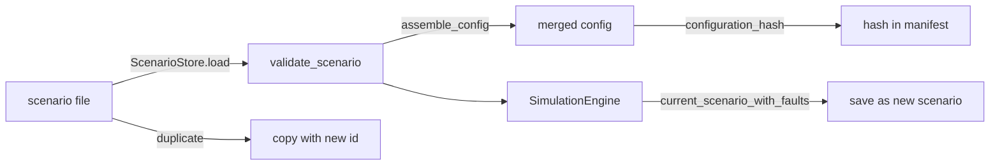

# Scenario model

A scenario is the complete, reproducible specification of a run (together with the configuration
files). It is stored as YAML or JSON in `scenarios/`, optionally wrapped in a top-level `scenario:` key.

## Fields (`validate_scenario`)

| Field | Required | Default | Validation / meaning |
|---|---|---|---|
| `id` | yes | — | `^[A-Za-z0-9][A-Za-z0-9_.-]{0,63}$`; also the file name when saved |
| `name`, `description` | no | id, "" | text |
| `seed` | no | 1 | integer ≥ 0; the root of every random stream and of the TEP seed |
| `tep_seed` | no | derived | explicit TEP LCG seed G (must be non-zero mod 2³²) |
| `duration_seconds` | no | 10800 | 1 s … 30 days |
| `simulation_start` | no | 2026-01-05T06:00:00Z | ISO time for event timestamps and technician shifts |
| `backend` | no | auto | auto / fortran / python |
| `control_mode` | no | CLOSED_LOOP | CLOSED_LOOP / MANUAL |
| `config_overrides` | no | {} | per section of `configs/`, deep-merged (lists of dicts with `id` merge by id) |
| `faults` | no | [] | fault specs ([fault injection](fault_injection.md)); ids must be unique |
| `production_orders` | no | [] | `order_id, product_id, quantity, unit, priority, planned_start, planned_end, customer` |
| `planned_maintenance` | no | [] | `asset_id, start_s, task, priority, duration_s` |
| `operator_actions` | no | [] | `time, action, <params>, actor` (actions: [simulation API](../08_api/simulation_api.md#operator-actions)) |
| `tags` | no | — | accepted, **not used** |

Unknown keys are rejected (`ConfigError`).

## Lifecycle

* **Load / execute:** `create_simulation(scenario_id)` → a new engine at t = 0.
* **Reset:** rebuild from the same scenario (and duration override).
* **Save:** refuses to overwrite unless `overwrite=true`.
* **Duplicate:** copy under a new id.
* **Save current run:** the UI "Scenario" tab calls `/api/benchmark/scenarios/current`. That converts the faults
  existing in the run into scenario faults: a fault that has activated becomes a
  `simulation_time` trigger at its activation time, one that never activated stays `manual`. The
  interactive history of *when* things were stopped or reset is not preserved.

## Included scenarios

| Id | Duration | Purpose |
|---|---|---|
| `SCN-COOL-001` | 3 h | demonstration: reactor CW pump degradation ([worked example](scenario_examples/SCN-COOL-001.md)) |
| `SCN-BASELINE` | 3 h | normal operation, no faults |
| `SCN-FAULT-LIBRARY` | 8 h | example of every fault type: 2 scheduled IDVs, 15 manual faults, 1 event-triggered fault, planned cooling-tower maintenance ([example](scenario_examples/SCN-FAULT-LIBRARY.md)) |

Source:
- `simulator/scenarios/__init__.py` — `validate_scenario`, `assemble_config`, `ScenarioStore`, `configuration_hash`
- `api/service.py` — `SimulatorService.current_scenario_with_faults`, `SimulatorService.create_simulation`
- `tests/test_api_ui.py` — `test_scenario_save_duplicate`
- `tests/test_reproducibility.py` — `test_every_library_scenario_loads_and_runs`
