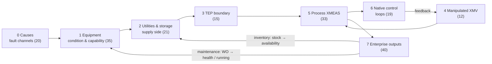

# Variable graph: model

## Why it exists

The simulator's behaviour is spread over four places:
* declarative relations (`coupling.yaml`);
* the native Fortran control scheme;
* TEP's equations;
* enterprise module code.

The **TEP Site Variable Graph** puts them in one picture: which variable can influence which, through
what kind of mechanism. It is an **explanatory and audit artefact**. The simulator does not execute it.

## Two graphs: be precise about which one you mean

| | Coupling graph | Variable graph |
|---|---|---|
| What | the 67 relations of `coupling.yaml` | coupling graph + TEP physics + native control + module logic + events |
| Executed by the simulator? | **yes**, every second (`CouplingEngine`) | **no** |
| Built by | `CouplingEngine.setup` (topological sort) | `scripts/build_variable_graph.py` |
| Shown in | simulator UI "Causal Model" tab (list), `/api/benchmark/coupling` | `docs/07_variable_graph/variable_graph.html` (standalone), and the published artifact page "TEP Site Variable Graph" |
| Authority | the definition of enterprise → TEP influence | a documentation view; four parts have different authority ([graph generation](graph_generation.md)) |

## Structure

* **195 nodes** (variables) and **258 directed edges** (influences), in the current repository state.
* **Nodes are placed in 8 cause-to-effect columns** (`layer` 0-7). Most edges point right; control
  feedback, the inventory loop and the maintenance loop point back left.

Numbers are nodes per column (`variable_graph.json → stats.nodes_by_layer`).

## What a node is

A node is one variable: an entity property, a fault cause channel, a boundary parameter, an XMEAS or
XMV, a native control loop, or a derived enterprise quantity such as a quality test or order progress.
Constants (`rated_*`, `nominal_*`, utility `capacity`) are omitted. See [node types](node_types.md).

## What an edge is

A directed edge `A → B` states that **a change in A can change B**, through the mechanism named by the
edge's `semantics`. It does not state magnitude, sign, delay or that the influence is always active.
Most edges are gated (e.g. by `is_running`) or saturate (e.g. `clip`). See [edge types](edge_types.md)
and [causal semantics](causal_semantics.md).

## What the graph does not contain

* **8 of 41 measurements have no edges** and are omitted: XMEAS(6), (29), (31), (32), (33), (35), (36),
  (37). They are not read by any relation, loop, quality test or metering, and not listed as influenced
  in `process_influences`.
* **TEP's internal coupling is represented only by documented edges**: `process_influences`, the direct
  valve equations and three extra TEFUNC relations. TEP couples many more variables internally
  (holdups, pressures, compositions).
* **Alarms** are omitted, except the two that raise work orders.
* **The fault engine's runtime behaviour** (triggers, progression) and the causal registry's labels.

Source:
- `scripts/build_variable_graph.py` — `build`, `main`
- `docs/07_variable_graph/variable_graph.json`
- `simulator/coupling/__init__.py` — `CouplingEngine.graph`
