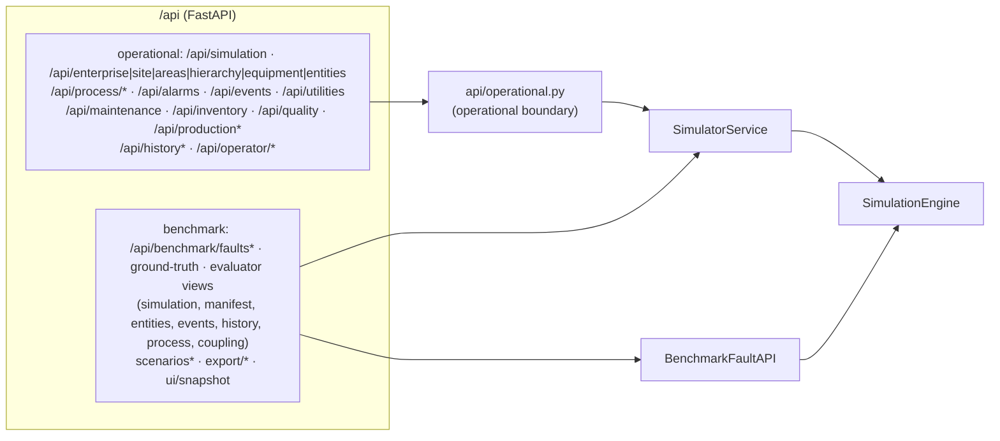

# API overview

## Two layers

1. **Python operations.** `SimulatorService` (operational) and `BenchmarkFaultAPI` (fault injection
   and ground truth) in `api/service.py`. Methods that read engine state take the service's re-entrant
   lock, the same lock the real-time runner holds while stepping. The exception is
   `get_simulation_state`, which reads without it (see [documentation vs implementation](../11_limitations/documentation_vs_implementation.md)).
2. **REST.** `api/app.py` (`create_app`) is a thin FastAPI wrapper, with OpenAPI docs at `/docs`.
   Static UI files are at `/ui/*`, and `/` serves `ui/index.html`.

## Design rules actually implemented

* **Generic entity/property access.** `/api/entities/{id}` and `/api/entities/{id}/properties/{prop}`;
  there are no `get_reactor_temperature`-style routes.
* **Fault injection only on `BenchmarkFaultAPI` / `/api/benchmark/*`.** The operational service object
  has no fault methods.
* **Operational boundary.** Every route outside `/api/benchmark/*` returns the operational view
  (`api/operational.py`): no ground truth, no model-internal state. `SimulatorService` read methods
  default to it; `truth=True` is used only by `/api/benchmark/*`
  ([canonical contract §20](../CANONICAL_SIMULATOR_CONTRACT.md#20-ground-truth)).
* **Error mapping:**
  * `KeyError` → 404;
  * `ValueError`, `ConfigError`, `FaultValidationError`, `TEPAdapterError` → 400;
  * `RuntimeError` → 409 (e.g. start after completion; step with no simulation).

  Illegal production-order transitions raise `ValueError`, so they return 400, not 409.
* **No authentication, no CORS configuration, no rate limiting.** `run.py` binds to `127.0.0.1` by
  default. The Dockerfile binds to `0.0.0.0`.
* **One simulation per server process.** `create_simulation` replaces the current one.

## Pages

[simulation API](simulation_api.md) · [state API](state_api.md) · [event API](event_api.md) ·
[benchmark API](benchmark_api.md) · [examples](examples.md)

Source:
- `api/app.py` — `create_app`
- `api/service.py` — `SimulatorService`, `BenchmarkFaultAPI`
- `tests/test_api_ui.py` — `test_required_operations_exist`
