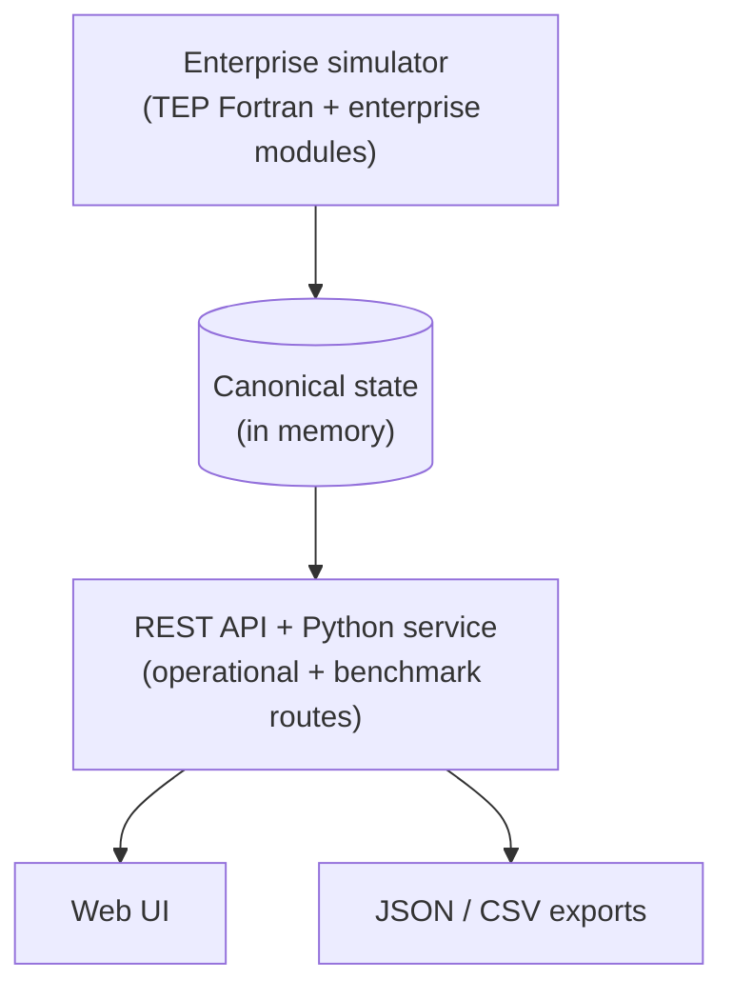
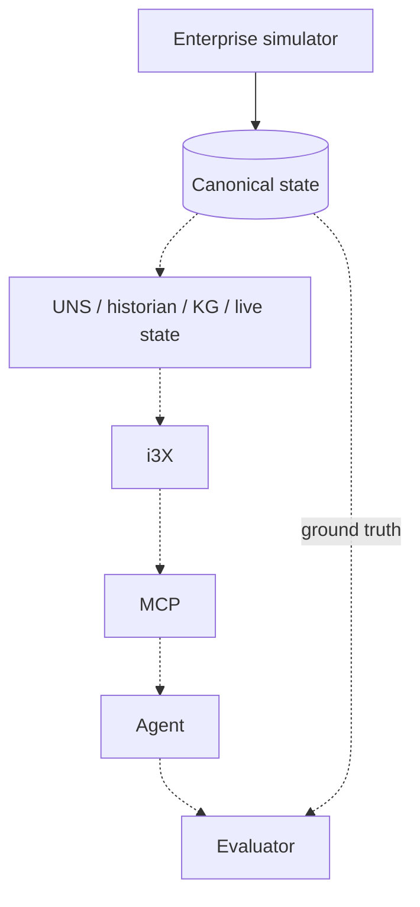

# Current scope vs future architecture

## CURRENTLY IMPLEMENTED

The simulator is independently runnable and understandable without any of the planned layers.

## PLANNED / FUTURE (nothing below exists in this repository)

Dashed means not implemented. The principle for those layers:

> The enterprise simulator defines simulated manufacturing reality. Downstream information
> technologies may later expose views of that reality, but they do not define or modify it.

## Integration points that exist today

| Future need | Existing hook | Caveat |
|---|---|---|
| Read state | `SimulatorService` methods; `CanonicalState` | not filtered for observability (see [benchmark limitations](benchmark_limitations.md)) |
| Stream events | `EventBus.subscribe`; `/api/events?after_id=` | contains correlation ground truth |
| Act on the plant | operator actions (`OperatorModule.execute`) | no authorisation |
| Evaluator ground truth | `BenchmarkFaultAPI`, exports, fault `expected_effects` | — |
| Stable identifiers | entity ids, XMEAS/XMV ids, event ids | ids are stable across runs of the same configuration |

## Things to settle before building downstream layers

1. Build downstream layers on the operational routes only (`/api/*` outside `/api/benchmark/*`); the operational boundary closed leaks G1–G16.
2. Whether downstream layers may issue operator actions, and which ones.
3. The time base: simulation time vs wall time; exported timestamps come from `simulation_start`.
4. Whether per-second data is needed. The trend buffer is 10 s; a historian would need its own
   subscription to every step.
5. Replayability: record operator commands with their simulation times.
