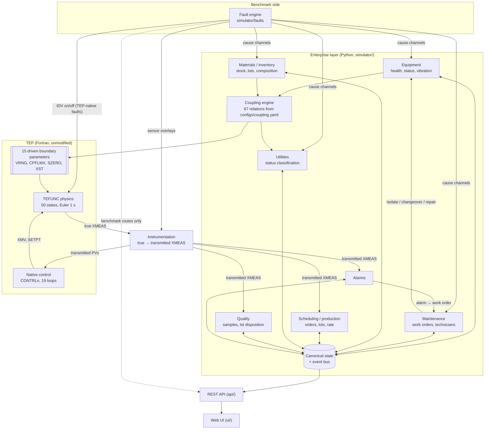
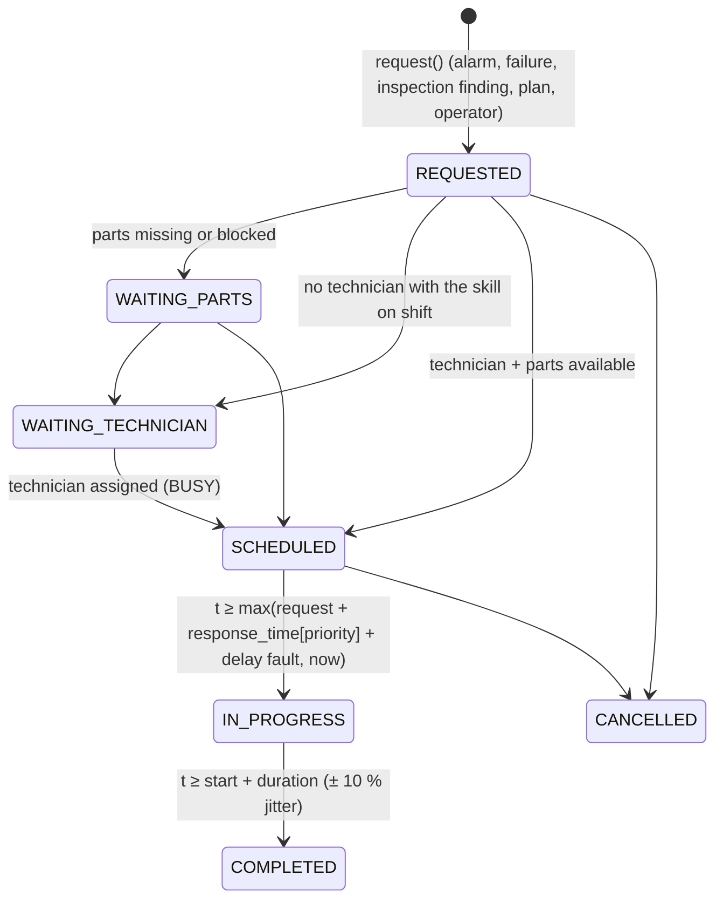
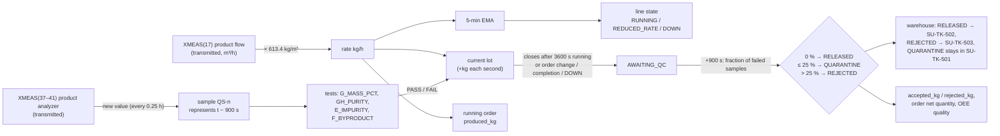
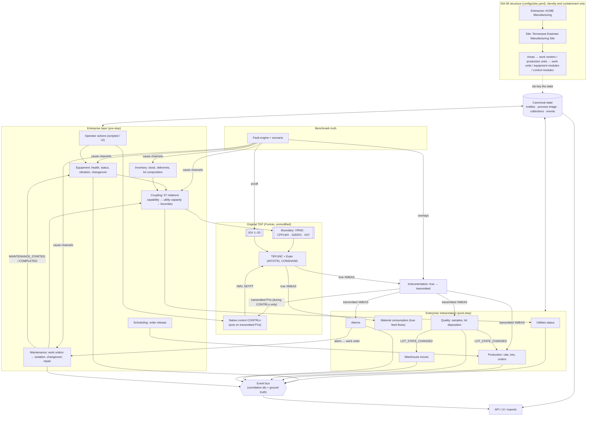

# Learning guide: how the ACME / Tennessee Eastman enterprise simulator works

This guide teaches the simulator from first principles, in 17 levels. Each level adds one layer of
detail. After the last level you should be able to predict, step by step, what happens when you inject
a fault: through the enterprise model, into TEP, through native control, and back out into alarms,
maintenance, production and quality.

**How to read it.**

* The reference documentation lives in the tree under [docs/README.md](README.md). This guide explains
  and links to it; it does not replace it. For the exact semantics of any value, event or coupling,
  the [canonical simulator contract](CANONICAL_SIMULATOR_CONTRACT.md) is authoritative.
* Every claim was checked against the code, configuration and tests in this repository. Paths are
  relative to the repository root. Functions are named instead of line numbers, so references survive
  edits. The only line numbers are for the unmodified Fortran sources.
* Labels used throughout:

  | Label | Meaning |
  |---|---|
  | **[TEP native]** | behaviour of the original Fortran (`teprob.f`, `temain_mod.f`), unmodified |
  | **[Enterprise]** | behaviour of the Python enterprise layer written for this simulator |
  | **[Benchmark truth]** | information that exists for scoring and must not reach a system under test |
  | **Uncertain** | not verified; stated as such rather than guessed |

**The running example.** Most levels use the demonstration scenario `scenarios/SCN-COOL-001.yaml`
(seed 18472, 3 h, Fortran backend). At 1:00, the duty reactor cooling-water pump P-101A
(`WU-CWP-101A`) starts to degrade. All times and values quoted for it come from running it; the
full observed event log is in [SCN-COOL-001_trace.md](06_scenarios/scenario_examples/SCN-COOL-001_trace.md).

Contents:

1. [What is the simulator?](#level-1-what-is-the-simulator)
2. [What happens when I run python run.py?](#level-2-what-happens-when-i-run-python-runpy)
3. [What happens during one simulation step?](#level-3-what-happens-during-one-simulation-step)
4. [What is TEP actually doing?](#level-4-what-is-tep-actually-doing)
5. [What happens when a pump fails?](#level-5-what-happens-when-a-pump-fails)
6. [Why does the TEP process respond the way it does?](#level-6-why-does-the-tep-process-respond-the-way-it-does)
7. [How does the enterprise model differ from TEP?](#level-7-how-does-the-enterprise-model-differ-from-tep)
8. [What is the variable graph?](#level-8-what-is-the-variable-graph)
9. [What is canonical state?](#level-9-what-is-canonical-state)
10. [What is ground truth?](#level-10-what-is-ground-truth)
11. [What happens during maintenance?](#level-11-what-happens-during-maintenance)
12. [How do production and quality work?](#level-12-how-do-production-and-quality-work)
13. [How does determinism work?](#level-13-how-does-determinism-work)
14. [How do we know it is correct?](#level-14-how-do-we-know-it-is-correct)
15. [What are the limitations?](#level-15-what-are-the-limitations)
16. [How would I add something?](#level-16-how-would-i-add-something)
17. [How does the whole thing fit together?](#level-17-how-does-the-whole-thing-fit-together)
* [The 20 things I should know about this simulator](#the-20-things-i-should-know-about-this-simulator)
* [The 10 most important things that are easy to misunderstand](#the-10-most-important-things-that-are-easy-to-misunderstand)
* [Where to find open issues](#where-to-find-open-issues)

---

## Level 1: What is the simulator?

### The one-paragraph mental model

The simulator is the unmodified Tennessee Eastman Process, a Fortran model of one chemical plant with
its original control system, surrounded by a Python model of the company that runs the plant. The
Python layer models the equipment that serves the process (pumps, cooling tower, boiler, compressor,
power), the utilities those machines deliver, the people and policies that maintain them, the raw
materials that feed the process, and the orders, lots and quality tests that turn process output into
business results. The two halves meet at exactly 15 driven numbers inside TEP that the plant around
the reactor would really determine, such as how much cooling water a fully open valve can pass. Every
simulated second, the Python layer updates the equipment and writes those numbers. TEP then runs its
controllers and physics for one second, and the Python layer reads the resulting measurements to
raise alarms, meter production and grade quality. A benchmark operator injects faults as *causes*
only. Everything downstream of a cause is computed, never scripted. The whole thing is deterministic
for a given seed.

### What each part represents

| Part | Represents | Is |
|---|---|---|
| **TEP** (`simulator/tep/fortran/src/teprob.f`) | a reactor, condenser, vapour-liquid separator, recycle compressor and product stripper making products G and H from feeds A, C, D, E (Downs & Vogel 1993) | 50 differential states, 41 measurements (XMEAS), 12 manipulated variables (XMV), 20 disturbances (IDV) |
| **Native control** (`simulator/tep/fortran/src/temain_mod.f`) | the decentralised control scheme of Russell, Chiang & Braatz | 19 velocity-form P/PI loops |
| **Enterprise layer** (`simulator/*/`) | an ISA-95 company (ACME Manufacturing, Tennessee Eastman site) around that plant | discrete-state and algebraic models, evaluated every second |
| **Fault engine** (`simulator/faults/`) | the benchmark operator's hand: what went wrong | 34 fault types (20 TEP IDVs plus 14 enterprise types) |
| **API and UI** (`api/`, `ui/`) | the operator's screens and a programmatic interface | FastAPI plus vanilla JavaScript |

**What the enterprise layer adds on top of TEP:**

* an ISA-95 hierarchy (87 elements) that maps every TEP variable onto equipment;
* 10 maintainable assets with health, wear and vibration (4 CW pumps in two redundant pairs, cooling
  tower, boiler, transformer, MCC, compressor, agitator);
* 4 utility services: reactor cooling water, condenser cooling water, steam and electrical power;
* raw-material storage, material lots with composition, and a spare-parts store;
* production orders, scheduling, hourly production lots and a warehouse;
* a product quality specification graded from TEP's analyzers;
* ISA-18.2-style alarms;
* maintenance: technicians, shifts, work orders and inspections;
* operator commands;
* events carrying ground-truth correlation ids.

**What the simulator does NOT represent:**

* **Utility physics.** There is no hydraulic network, no heat-exchanger model of the cooling tower and
  no electrical load flow. These are algebraic approximations
  ([coupling limitations](11_limitations/coupling_limitations.md)).
* **Restart after a trip.** After a TEP interlock trip the process freezes, with no restart sequence.
* **Other operating modes.** Only one product mode (Mode 1, 50/50 G/H) is modelled; there are no grade
  changes and no start-up.
* **Human operators.** Operator actions come from scripted scenario actions or from you, through the
  UI or API.
* **Business depth.** There are no costs, prices or finance, and no customer demand model beyond order
  quantities.
* **Industrial infrastructure.** There is no UNS, MQTT, historian, knowledge graph, i3X, MCP or agent
  interface. These were explicitly out of scope ([future extensions](11_limitations/future_extensions.md)).

### What is authoritative

| Question | Authority |
|---|---|
| Process physics: temperatures, pressures, levels, flows, compositions | TEP (`TEFUNC`), always |
| Control actions on the process | TEP's native controllers (`CONTRLn`), plus operator commands that pass validation |
| Whether the plant has tripped | TEP's limits, re-evaluated on noise-free values by `BaseTEPAdapter._evaluate_shutdown` |
| Equipment condition, utility capacity, work orders, lots, orders | the enterprise module that owns them (Level 9) |
| Which fault is active, and why an event happened | the fault engine and the causal registry **[Benchmark truth]** |

### One-page architecture



**Before moving on, understand that:** the enterprise layer never computes a process temperature,
pressure or composition. It changes only inputs that TEP already has, and it reads what TEP produces.

---

## Level 2: What happens when I run python run.py?

`python run.py` runs `run.main` (`run.py`). This is the whole start-up, in order, with the function
that does each step.

### Launcher (`run.py`)

1. **Arguments.**
   * `--scenario` (default `SCN-COOL-001`) and `--backend auto|fortran|python` (default `auto`).
   * `--host` / `--port` (default `127.0.0.1:8000`) and `--no-browser`.
2. **Dependencies.** `check_deps` imports numpy, yaml, fastapi, uvicorn and pydantic, and exits with an
   install hint if any is missing.
3. **TEP library.** `ensure_fortran` asks `simulator.tep.fortran_backend.is_available()` whether the
   compiled library exists.
   * If it does not, `run.py` runs `scripts/build_fortran.py` (local gfortran, else Docker).
   * If that fails and the backend is `auto`, it prints a warning and falls back to the Python
     development backend. With `--backend fortran` it exits instead.
   * The chosen backend is passed on through the environment variable `TEP_BACKEND`.
4. **Logging.** Logging is configured, then `api.app.create_app(autoload=<scenario>)` is called.

### Application (`api/app.py`, `api/service.py`)

5. **Service and runner.** `create_app` builds a `SimulatorService`. Its constructor creates a
   re-entrant lock, a `ScenarioStore` over `scenarios/`, and a `Runner` thread. The runner starts
   immediately but **idles** (`running = False`). It also builds the separate `BenchmarkFaultAPI`
   around the same service.
6. **Scenario.** `create_app` calls `SimulatorService.create_simulation(autoload)`:
   * `ScenarioStore.load` reads `scenarios/SCN-COOL-001.yaml`;
   * `validate_scenario` rejects unknown keys and bad values;
   * seed and backend overrides are applied;
   * under the lock, a `SimulationEngine(scenario)` is constructed (next section);
   * the runner's speed (default 10× real time) and step cap (2000 per tick) are read from
     `configs/simulation.yaml → runner`.
7. **Routes.** The REST routes are registered (`/api/*` operational, `/api/benchmark/*` fault
   injection and ground truth). The UI is mounted: `ui/` is served at `/ui` and `ui/index.html` at `/`.
8. **Server.** `uvicorn.run` starts the HTTP server, and a timer opens the browser after 1.5 s.

### Engine construction (`SimulationEngine.__init__` and `_build`, `simulator/simulation/engine.py`)

9. **Configuration.** `assemble_config` loads the 12 files `configs/*.yaml`. It deep-merges the
   scenario's `config_overrides` over them and copies the scenario's faults, production orders, planned
   maintenance and operator actions in. `configuration_hash` hashes scenario plus configuration; the
   first 10 characters go into the `run_id`.
10. **Adapter.** `create_adapter(backend)` returns a `FortranTEPAdapter` (preferred when `auto`) or a
    `PythonTEPAdapter`. The Fortran adapter loads the shared library through ctypes. A second
    concurrent adapter in the same process loads a private copy of the library from a temp directory.
11. **Core objects**, in this order:
    * `SimulationClock` (integer seconds from `simulation_start`);
    * `Hierarchy.from_config` (ISA-95, validated);
    * `TEPMapping.from_config` (every XMEAS/XMV/IDV/loop bound to an equipment element, validated);
    * `CanonicalState`;
    * `EventBus`;
    * `RandomStreams(seed)`;
    * `Instrumentation`;
    * `ProcessInterface`.
12. **Hierarchy entities.** `_register_hierarchy` registers every ISA-95 element as an entity in the
    canonical state.
13. **Seeds.** The TEP seed is `scenario.tep_seed` if given, else `RandomStreams.tep_seed()`: an odd
    32-bit number derived from the scenario seed with numpy `SeedSequence`.
14. **TEP initialisation.** `ProcessInterface.initialize(tep_seed, control_mode)` →
    `BaseTEPAdapter.initialize`:
    * `FortranTEPAdapter._native_init` **zeroes every Fortran common block** and then calls `TEINIT`
      **[TEP native]**. Zeroing first matters because TEINIT does not reset everything, for example
      the Newton initial guesses TCR/TCS/TCC/TCV. It also sets `DELTAT` to single-precision 1/3600 h.
    * `_set_seed` writes the TEP seed into `/RANDSD/ G`, *after* TEINIT, because TEINIT assigns its
      own G.
    * `_load_native_controller_configuration` replicates what `temain_mod.f` MAIN assigns before its
      loop: 20 setpoints, gains and reset times (as float32 constants from
      `simulator/tep/control_scheme.py`), initial XMVs, purge flag 0. It must be replicated because
      MAIN itself is never executed.
    * Loop modes are reset (AUTO, or CAS for cascade slaves).
    * Back in `ProcessInterface.initialize`, the TEINIT boundary values are recorded as **nominal**,
      the instrumentation is reset, and a first `sync` fills the process image.
15. **Modules.** `ModuleContext` is created and the 13 modules are constructed. `_register_commands`
    registers the 12 operator commands (set_setpoint, set_loop_mode, set_xmv, equipment_command,
    acknowledge_alarm, request_maintenance, …).
16. **Setup**, in this exact order: equipment, utilities, materials, inventory, warehouse, production,
    scheduling, quality, maintenance, alarms, coupling, faults, operator. Notable steps:
    * `CouplingEngine.setup` expands, validates and topologically sorts the relations, then evaluates
      them once to record each relation's **baseline**. The t = 0 boundary values equal the TEINIT
      values because of design margins (Level 5).
    * `FaultEngine.setup` creates the scenario's faults. `F-COOL-001` becomes SCHEDULED, and
      `FAULT_CREATED` and `FAULT_SCHEDULED` are published **[Benchmark truth]**.
17. **Trends and first observation.** The trend buffer is built (166 series, every 10 s). The manifest
    goes into `state.run`. A t = 0 observation pass runs utilities, warehouse and alarms `post_step(0)`,
    and the first trend sample is recorded. Status = `READY`.

### After start-up

18. **Starting the simulation.** Nothing advances until you press **Start** in the UI (or
    `POST /api/simulation/start`). `SimulatorService.start_simulation` calls `SimulationEngine.start`,
    which sets status `RUNNING` and publishes `SIMULATION_STARTED` with a lifecycle id `LC-…`, and sets
    `runner.running = True`. From then on, every 20 ms the runner computes how many seconds are due
    (elapsed wall time × speed, capped at 2000) and calls `engine.step(n)` under the lock.
19. **UI polling.** The UI polls `GET /api/benchmark/ui/snapshot` about once per second and renders what it
    returns. It holds no simulation state.

```mermaid
sequenceDiagram
  participant U as You
  participant R as run.py main
  participant A as create_app
  participant S as SimulatorService
  participant E as SimulationEngine._build
  participant T as TEP adapter
  U->>R: python run.py
  R->>R: check_deps, ensure_fortran (build if missing)
  R->>A: create_app(autoload="SCN-COOL-001")
  A->>S: SimulatorService() — Runner thread idle
  A->>S: create_simulation()
  S->>E: SimulationEngine(scenario)
  E->>E: assemble_config + hash, clock, hierarchy, mapping, state, bus, RandomStreams(seed)
  E->>T: initialize(tep_seed): zero commons → TEINIT → seed G → native controller constants
  E->>E: setup 13 modules (coupling records baselines, faults scheduled)
  E-->>S: READY
  R->>R: uvicorn.run, open browser
  U->>S: Start (UI button)
  S->>E: start() → SIMULATION_STARTED (LC id); runner.running = True
  loop every 20 ms
    S->>E: step(n) under lock
  end
```

### Random seed handling in one place

| Seed | Derived from | Used by |
|---|---|---|
| scenario `seed` (18472 in the demo) | the scenario file (or the UI/API override) | everything below |
| per-module streams | `RandomStreams.get(name)`: PCG64 seeded by (seed, hash of the module name) | equipment vibration and wear noise, maintenance duration jitter, and other module draws |
| TEP seed `G` | `RandomStreams.tep_seed()` (odd, 32-bit), or `scenario.tep_seed` | TEP's own LCG: measurement noise and random-walk disturbances **[TEP native]** |

**Before moving on, understand that:** start-up builds a complete, `READY` engine, but simulated time
stays at 0 until something calls `step`. A scenario is fully defined by its file, the 12 config files
and the TEP library, which is exactly what the manifest records.

---

## Level 3: What happens during one simulation step?

A step advances simulated time from `t` to `t + 1` (one second, TEP's native Euler step). The whole
step is `SimulationEngine._step_once`:

```python
t = self.clock.time_s
for m in self.pre_modules:        # faults, operator, equipment, maintenance, inventory, scheduling, coupling
    m.pre_step(t)
self.process.step()               # native controllers (if due) + INTGTR + CONSHAND
self.clock.advance(1)
self.process.sync()               # new process image into canonical state
if newly shut down: publish PROCESS_SHUTDOWN
for m in self.post_modules:       # utilities, inventory, production, quality, warehouse, alarms
    m.post_step(t + 1)
self.history.record(t + 1)        # trend sample every 10 s
```

### The assumed order vs the actual order

A natural guess is: *enterprise state → equipment/utilities → coupling → TEP boundary → TEP execution
→ TEP measurements → native control → enterprise state/events → UI*. The actual order differs in
three important ways:

1. **Native control runs *before* the physics in each step, not after the measurements.**
   * The controllers that are due act on the measurements produced at the end of the *previous*
     integration. Then `INTGTR` integrates, which creates the new measurements.
   * This mirrors one iteration of the `temain_mod.f` main loop.
2. **Utilities are split across the step.**
   * Utility *quantities* (capacity, fraction, supply temperature) are computed by coupling relations
     in the pre-step.
   * Utility *status* (NORMAL / DEGRADED / CONSTRAINED / UNAVAILABLE) and its events are computed in
     the post-step.
3. **Observations lag by one second.**
   * Relations that read the process (for example `UT-CW-REACTOR.flow = XMV(10) × VRNG(10) / 100`)
     run in the pre-step. They therefore see the process image from the previous step.
   * In contrast, a boundary value written in pre-step `t` is used by the integration from `t` to
     `t + 1` in the same step.

```mermaid
sequenceDiagram
  autonumber
  participant F as FaultEngine
  participant P as Operator / Equipment /<br/>Maintenance / Inventory / Scheduling
  participant C as CouplingEngine
  participant PI as ProcessInterface
  participant A as TEP adapter (Fortran)
  participant O as Utilities / Inventory / Production /<br/>Quality / Warehouse / Alarms
  Note over F,O: pre_step(t)
  F->>F: start due faults, write cause channels (intensity at t), stop on duration
  P->>P: scripted operator actions; wear + status + vibration + changeover;<br/>work orders; deliveries + lot attributes; order release
  C->>C: evaluate 67 relations in topological order (reads last step's process image)
  C->>PI: set_boundary(name, value) only if changed
  PI->>A: write VRNG / CPFLMX / SZERO / XST in Fortran memory
  Note over PI,A: TEP step
  PI->>A: step(1, measurement_filter)
  A->>A: if loops due (every 3 / 360 / 900 steps): swap transmitted XMEAS into /PV/,<br/>CONTRLn in native order, restore true XMEAS
  A->>A: INTGTR (TEFUNC + Euler), CONSHAND (clamp XMV 1–11 to 0–100)
  A->>A: shutdown check on noise-free internals
  Note over F,O: clock → t+1
  PI->>A: sync(): read XMEAS, XMV, IDV, SETPT, loop table, shutdown
  PI->>PI: transmitted = instrumentation.observe(true); write process image + mapped equipment props
  Note over F,O: post_step(t+1)
  O->>O: utility status; material consumption (true feed flows); production metering, lots;<br/>quality samples + lot decisions; warehouse moves; alarms (→ maintenance requests)
```

### What each phase reads and writes

| Phase | Reads | Writes | Events it can publish |
|---|---|---|---|
| `FaultEngine.pre_step` | its fault records, clock | `fault_effects` channels, IDV (native faults), sensor overlays | FAULT_* **[Benchmark truth]** |
| `OperatorModule.pre_step` | scripted actions due | whatever the command changes (setpoint, mode, equipment state, …) | OPERATOR_ACTION and the command's event |
| `EquipmentModule.pre_step` | `damage`, `failed` channels; maintenance flags | `health`, `status`, `is_running`, `vibration`, `run_hours`, `role` | EQUIPMENT_STATE_CHANGED / DEGRADED / FAILED |
| `MaintenanceModule.pre_step` | work orders, technicians, spare parts, `response_delay_s` | work-order status, technician status | MAINTENANCE_* |
| `InventoryModule.pre_step` | deliveries due, supply faults | stock, lots, supply availability, lot composition | MATERIAL_* |
| `SchedulingModule.pre_step` | orders, material availability | order status | PRODUCTION_ORDER_* |
| `CouplingEngine.pre_step` | entity properties, `fault.*` channels, `process.*` (previous step), TEP nominal values | derived entity properties, **TEP boundary parameters**, causal registry | none (it labels causes; modules publish) |
| TEP step | boundary, XMV, SETPT, IDV, transmitted PVs (controllers only) | TEP states, XMEAS, XMV, SETPT | none |
| `ProcessInterface.sync` | adapter | `state.process`, mapped equipment properties, loop table | none (the engine publishes PROCESS_SHUTDOWN) |
| post-step modules | process image (transmitted, except inventory), entity properties | utility status, stock, lots, samples, alarms | UTILITY_STATE_CHANGED, MATERIAL_CONSUMED, LOT_STATE_CHANGED, QUALITY_*, ALARM_*, MAINTENANCE_REQUESTED (via alarm) |
| `TrendBuffer.record` | state | in-memory series | none |

**Event timestamps follow the phase.** An event published in the pre-step carries time `t`; one
published in the post-step carries `t + 1`. The event bus is synchronous: a handler runs inside
`publish`, before the publishing module continues. That is how an alarm in the post-step creates a work
order in the same second (`MaintenanceModule._on_alarm`).

**Before moving on, understand that:** the step is a fixed, single-threaded sequence. The UI's speed
setting only changes how many steps run per wall-clock tick. It never changes what a step does.

---

## Level 4: What is TEP actually doing?

### What the Fortran model owns **[TEP native]**

* **50 states** (`YY`): component holdups in the reactor, separator, stripper and compressor; energy
  states (temperatures); cooling-water outlet temperatures; and the 12 valve positions.
* **The physics** (`TEFUNC`, `simulator/tep/fortran/src/teprob.f`): thermodynamics (`TESUB1`–`TESUB4`),
  reaction kinetics, flows through valves, energy balances, measurement noise (`TESUB6`), and random
  walks for disturbances (`TESUB7`, `TESUB8`).
* **The native control law** (`temain_mod.f`): `CONTRL1`–`CONTRL11` and `CONTRL13`–`CONTRL20`, 19 loops
  in total. There is no `CONTRL12`, and `CONTRL22` is defined but never called. `CONSHAND` clamps XMV
  1–11 to 0–100 %.
* **The shutdown logic** (`teprob.f` lines 702–710): the trip limits are reactor pressure > 3000 kPa,
  reactor temperature > 175 °C, and limits on reactor, separator and stripper liquid volume. After a
  trip, TEFUNC sets every derivative to zero (lines 807–811), so the process freezes.

### XMEAS, XMV, IDV

| Symbol | Count | What it is | Example (demo) |
|---|---|---|---|
| **XMEAS(n)** | 41 | what TEP's instruments report. XMEAS 1–22 are continuous every second, with TEP's own noise. XMEAS 23–36 are analyzers sampled every 0.1 h with a 0.1 h dead time. XMEAS 37–41 are product analyzers sampled every 0.25 h with a 0.25 h dead time. | XMEAS(9) reactor temperature 120.4 °C; XMEAS(21) reactor CW outlet temperature; XMEAS(40)/(41) G and H in product (mol %) |
| **XMV(n)** | 12 | valve / actuator *commands* in %, written by the controllers (or by an operator in MAN). The valve *position* `VPOS` follows the command with a first-order lag `VTAU` inside TEFUNC. | XMV(10) reactor CW valve, 41.2 % at base case |
| **IDV(n)** | 20 | TEP's built-in disturbances, on or off (TEFUNC treats any value > 0 as 1) | IDV(4) is a step in the reactor CW inlet temperature |

### What the native controllers do **[TEP native]**

Each loop is a velocity-form PI (or P) algorithm, for example `CONTRL10`:

```fortran
ERR10 = (SETPT(10) - XMEAS(21)) * 100. / 150.
DXMV  = GAIN10*((ERR10 - ERROLD10) + ERR10*DELTAT*3./TAUI10)
XMV(10) = XMV(10) + DXMV
```

* **Timing.** 14 loops run every 3 s. Four analyzer loops run every 360 s. `CONTRL20` (product E
  composition) runs every 900 s.
* **Cascades.** Eight loops are cascade masters: they write another loop's `SETPT` instead of an XMV.
  For example, TC-RX (`CONTRL18`) writes `SETPT(10)`, the setpoint of TC-RCW. The generated
  [native_control_loops.md](03_tep/native_control_loops.md) lists every loop.
* **Periods.** The adapter reproduces MAIN's schedule in `BaseTEPAdapter._due_loops` using
  `control_scheme.LOOPS` / `EXECUTION_ORDER`.

### Exactly what the enterprise layer is allowed to change in Fortran memory

This list is complete. The full contract is in [coupling contract](04_coupling/coupling_contract.md).

| Write | Who | When | Path |
|---|---|---|---|
| 15 boundary parameters: `VRNG(1,2,3,4,9,10,11)` (valve ranges), `CPFLMX` (compressor capacity), `SZERO(1,2,5,6)` (random-walk means: stream-4 A/B fractions, CW supply temperatures), three `XST` feed impurities | coupling engine only | pre-step, only when the value changed | `ProcessInterface.set_boundary` → `set_boundary_parameter` (clamped to the parameter's range) → `FortranTEPAdapter._set_boundary` |
| `IDV(n)` on or off | fault engine only (TEP-native fault types) | fault start / stop | `ProcessInterface.set_disturbance` |
| `XMV(n)` | operator | only when the loop that drives it is not executing (MAN), otherwise refused | `BaseTEPAdapter.set_manipulated_variable` |
| `SETPT(k)` | operator | only when no active cascade master writes it, otherwise refused | `BaseTEPAdapter.set_setpoint` |
| `ERROLDn` | adapter | on a MAN → AUTO transition, for a bumpless start | `BaseTEPAdapter._bumpless_init` |
| `/PV/ XMEAS` | adapter | **temporarily**, only while `CONTRLn` runs: transmitted values in, true values restored right after | `BaseTEPAdapter.step` (`measurement_filter`) |
| common blocks, `G`, controller constants, initial XMV | adapter | initialisation only | `BaseTEPAdapter.initialize` |

Two boundary parameters defined in `simulator/tep/boundary.py` are not driven by any relation (17
defined, 15 coupled): the D-feed and stream-4 temperature means, `SZERO(3)` and `SZERO(4)`.

### What the enterprise layer never modifies

* TEP states (`YY`) and derivatives;
* the TEFUNC equations;
* controller gains and reset times after initialisation;
* TEP's random-number state after seeding;
* the XMEAS values that TEFUNC computes (the PV swap is reversed before integration);
* the trip limits.

The Fortran source is compiled unmodified (source hashes are in
[TEP version and provenance](03_tep/tep_version_and_provenance.md)).

### The boundary, very concretely

`VRNG(10)` is the flow a fully open reactor cooling-water valve can pass. TEP assumes 1000. Line 573 of
`teprob.f`:

```fortran
FWR = VPOS(10)*VRNG(10)/100.0
```

The enterprise layer's entire influence on reactor cooling is the value it puts into `VRNG(10)`. It
decides that value from pumps, utility capacity and faults. It never touches `FWR`, `TWR`, `TCR` or
XMEAS(9). TEP turns the new `VRNG(10)` into everything else. The other boundary parameters work the same
way ([boundary variables](04_coupling/boundary_variables.md)). The supply-temperature parameters
`SZERO(5)` and `SZERO(6)` are special: they are *means* of TEP random walks, so a change takes effect
only at the walk's next knot, 0.1–0.4 h later.

**Before moving on, understand that:** "coupling to TEP" means writing one of 15 numbers that TEFUNC
reads as an input condition. There is no other door into the physics, except the benchmark's IDV
switches.

---

## Level 5: What happens when a pump fails?

The implemented scenario is `SCN-COOL-001`. The pump does not fail outright: it degrades until the
reactor cooling-water circuit cannot deliver the design flow. (A hard failure, `equipment_failure`,
follows the same path with `failed = 1` and triggers an automatic changeover to the standby pump after
`changeover_delay_s` = 30 s; `test_failure_changeover_and_maintenance_recovery` covers it.)

The only thing the benchmark sets:

```yaml
- id: F-COOL-001
  type: cooling_degradation   # on a pump this writes the 'damage' channel
  target: WU-CWP-101A
  trigger: {mode: simulation_time, time: 3600}
  severity: 0.62
  progression: {mode: gradual, ramp_s: 1800}
  duration: 1800
```

### The chain, arrow by arrow

Type key: **physical** = computed by TEP physics; **control** = native controller action;
**derived** = an enterprise algebraic relation or rule; **event** = a discrete event and the records
it creates.

| # | Arrow | Actual variable(s) | Subsystem | Source / configuration | Type | Demo evidence |
|---|---|---|---|---|---|---|
| 1 | fault → equipment condition | `fault_effects[(WU-CWP-101A, damage)] = 0.62 × intensity`, intensity ramping 0 → 1 over 1800 s; `health = intrinsic_health − damage` | FaultEngine → EquipmentModule | `CoolingDegradation.apply`, `FaultEngine._intensity`; `EquipmentModule.health`, `_resolve`; `configs/equipment.yaml` (initial health 0.97, wear 0.0004/h) | injected cause → derived | health 0.97 → 0.348 (minimum) |
| 2 | condition → observable indicator | `vibration = 1.8 + 10 × (1 − health)² + noise` | EquipmentModule | `_resolve`; `condition_monitoring` defaults | derived | crosses 3.8 mm/s at about 01:20 |
| 3 | condition → status | `status = DEGRADED` when health < 0.75 | EquipmentModule | `thresholds.degraded` | derived → event | EQUIPMENT_DEGRADED + EQUIPMENT_STATE_CHANGED at 01:10:34 |
| 4 | condition → capability | `efficiency = clip(health,0,1) × (1 − efficiency_loss)`; `available_flow = 1100 × efficiency × is_running × MCC supply fraction` | CouplingEngine | `CR-PUMP-EFFICIENCY`, `CR-PUMP-FLOW` in `configs/coupling.yaml` | derived (enterprise approximation of a pump curve) | — |
| 5 | capability → utility | `UT-CW-REACTOR.available_capacity = (flow A + flow B) × (1 − capacity_loss)`; `capacity_fraction = clip(available / 1000, 0, 1)` | CouplingEngine | `CR-CW-RX-CAPACITY`, `CR-CW-RX-FRACTION` | derived | fraction < 1 once health < ≈ 0.909; minimum 0.382 |
| 6 | utility → utility status | availability < 0.999 → DEGRADED; utilization ≥ 0.97 → CONSTRAINED | UtilitiesModule | `_classify`; `configs/utilities.yaml → status_thresholds` | derived → event | UTILITY_STATE_CHANGED DEGRADED 01:02:57, CONSTRAINED 01:28:16 |
| 7 | utility → TEP boundary | `tep.boundary.reactor_cw_max_flow` = `VRNG(10) = 1000 × capacity_fraction` | CouplingEngine → ProcessInterface → adapter | `CR-CW-RX-TEP`; `ProcessInterface.set_boundary` | derived (interface write) | VRNG(10) 1000 → 382 |
| 8 | boundary → TEP response | `FWR = VPOS(10)·VRNG(10)/100` → CW outlet temperature `TWR` (XMEAS 21) rises → heat removal `QUR = UAR·(TWR − TCR)` shrinks → reactor temperature `TCR` (XMEAS 9) rises | TEP | `teprob.f` lines 573, 672, 789–790 | **physical** | XMEAS(9) peak 138.21 °C at 01:45:40 |
| 9 | TEP → controller | TC-RCW (`CONTRL10`) raises XMV(10) as XMEAS(21) exceeds `SETPT(10)`; TC-RX (`CONTRL18`) lowers `SETPT(10)` as XMEAS(9) exceeds 120.4 | TEP native control | `temain_mod.f` CONTRL10, CONTRL18 | **control** | XMV(10) 41 % → 100 % at 01:28:50; `SETPT(10)` → −675.7 |
| 10 | → alarms / events | VAH-CWP101A (vibration > 3.8, 10 s on-delay); OUTH-L10 (loop 10 output ≥ 98 %, 30 s); UA-CWRX-CAP (utilization ≥ 0.97, 60 s); TAH-09 (XMEAS 9 > 122.5) | AlarmModule | `configs/alarms.yaml`; `AlarmModule.post_step` | event | 01:20:33, 01:28:57, 01:29:16, 01:31:35 |
| 11 | alarm → maintenance | an alarm with `maintenance: corrective` → work order WO-00001 (P2), not before request + 1500 s, technician with skill `mechanical`, parts reserved | MaintenanceModule | `_on_alarm`, `request`, `_plan`; `configs/maintenance.yaml` | event | requested and scheduled 01:20:33; started 01:45:33 |
| 12 | maintenance → equipment state | P-101A `under_maintenance`, desired STOP; standby P-101B desired RUN | EquipmentModule | `_on_maintenance_started` | event (state transition) | EQUIPMENT_STATE_CHANGED ×2 at 01:45:33 |
| 13 | → recovery of capacity | P-101B `is_running = 1` → available flow 1100 × 0.95 = 1045 → fraction 1.0 → VRNG(10) = 1000 | CouplingEngine | same relations as 4–7 | derived | UTILITY_STATE_CHANGED NORMAL at 01:45:52 |
| 14 | → recovery of the process | valve at full capacity, wound-up `SETPT(10)` → over-cooling | TEP + native control | Level 6 | **physical + control** | XMEAS(9) minimum 116.0 °C at 02:20:40; TAL-09 at 02:04:05 |
| 15 | → quality | transmitted XMEAS(40)/(41) → `G_MASS_PCT = 100·62G/(62G + 76H)`, limits 47.5–52.5 | QualityModule | `_product_sample`; `configs/quality.yaml` | derived | QS-00009 FAIL at 02:15:01 (represents 02:00:01) |
| 16 | → lot disposition | 1 of 4 samples failed = 25 % → QUARANTINE (> 0 % and ≤ 25 %) | QualityModule → Production / Warehouse | `_decide_product_lots`; `lot_disposition` | event | PL-0003 QUARANTINE at 02:40:10 |
| 17 | → repair | after 3940 s (60 min ± 10 % jitter): health 0.98, `damage` channel cleared, P-101A → STANDBY; fault marked remediated, correlation cleared | Maintenance → Equipment → FaultEngine | `_complete`, `_on_maintenance_completed`, `FaultEngine._on_repaired` | event | EQUIPMENT_REPAIRED at 02:51:13 |

Two numbers explain the timing:

* **Why capacity only starts to fall at 01:02:57.** The pump is rated at 1100 flow units against a
  circuit design of 1000. A healthy pump (health 0.97 → 1067 units) therefore gives a fraction clipped
  to exactly 1.0, and `VRNG(10)` stays at its native 1000. Only when damage pushes available flow below
  1000 (health < ≈ 0.909, reached about 3 minutes into the ramp) does TEP see anything. This **design
  margin** is also why a healthy run is bit-identical to bare TEP (Level 14).
* **Why the maintenance starts at 01:45:33.** Priority 2 has a response time of 1500 s: 01:20:33 +
  25 min = 01:45:33. TECH-01 was on shift (06:00–18:00; the simulated day starts at 06:00).

```mermaid
flowchart LR
  F["F-COOL-001<br/>[Benchmark truth]"] -->|"damage channel"| H["P-101A health"]
  H -->|derived| V["vibration"] -->|"alarm VAH (event)"| WO["WO-00001"]
  H -->|derived| E["efficiency → available_flow"]
  E -->|derived| U["UT-CW-REACTOR<br/>capacity_fraction"]
  U -->|"interface write"| B[["VRNG(10)"]]
  B -->|physical| TW["XMEAS(21) ↑"] -->|physical| TR["XMEAS(9) ↑"]
  TW -->|control| X10["XMV(10) → 100 %"]
  TR -->|control| SP["SETPT(10) ↓ (winds up)"]
  WO -->|"event: after 1500 s"| CH["P-101B RUN, P-101A isolated"]
  CH -->|derived| U
  SP -->|"control: undershoot"| TL["XMEAS(9) 116 °C"]
  TL -->|"physical: G/H shift"| Q["G_MASS_PCT FAIL"] -->|event| L["PL-0003 QUARANTINE"]
```



**Before moving on, understand that:** the benchmark wrote one number (`damage`). Every other value in
this table was computed by a module, a relation, TEP or a controller. Try tracing a different fault the
same way: find which channel it writes (`simulator/faults/types.py`), which relation or module reads
that channel, and which boundary parameter, if any, it reaches.

---

## Level 6: Why does the TEP process respond the way it does?

"The fault propagates" hides the interesting part. Here is the mechanism in the demo, with native and
enterprise behaviour separated.

### 1. Less cooling water at the same valve opening **[TEP native]**

`VRNG(10)` falls from 1000 towards 382. At an unchanged valve position, `FWR = VPOS·VRNG/100` falls.
The cooling-water jacket temperature evolves as (`teprob.f` lines 789–790):

```
dTWR/dt = ( FWR · 500.53 · (TCWR − TWR) − QUR · 10⁶ / 1.8 ) / HWR
QUR     = UAR · (TWR − TCR)          (negative: heat flows from reactor to water)
```

Less flow means less fresh water at `TCWR`, so `TWR` (XMEAS 21) rises. A warmer jacket shrinks the
driving force `TCR − TWR`, so less heat leaves the reactor, and reactor temperature `TCR` (XMEAS 9)
drifts upward.

### 2. The cascade compensates while it can **[TEP native]**

* **TC-RCW (inner loop, every 3 s):** `ERR = (SETPT(10) − XMEAS(21))·100/150`, gain −1.56. A rising
  XMEAS(21) makes the error negative, and the negative gain turns that into a positive `DXMV`: **the
  valve opens**. Opening the valve restores `FWR`, which is why reactor temperature barely moves at
  first: from 01:03 to about 01:28 XMV(10) climbs from 41 % to about 98 % while reactor temperature stays
  below the 122.5 °C alarm limit until 01:31:35.
* **TC-RX (outer loop, every 3 s):** `ERR = (120.4 − XMEAS(9))·100/150`, gain +28.3. As XMEAS(9) rises
  above 120.4, it **lowers `SETPT(10)`**, asking the inner loop for colder water.

### 3. Saturation **[TEP native]**

At base case the valve sits at about 41 % of 1000 ≈ 410 flow units. When capacity falls towards
roughly that value (fraction about 0.41), even 100 % cannot deliver the heat removal the reactor
needs. `CONSHAND` clamps XMV(10) at 100 % (01:28:50). The OUTH-L10 alarm, an enterprise alarm on the
control module's `output`, follows 30 s later. From here the reactor temperature is no longer
controlled: it rises to 138.21 °C by 01:45:40. Reactor pressure rises with it, to a peak of 2822 kPa
against the 3000 kPa trip.

### 4. Wind-up: where exactly it happens **[TEP native]**

The velocity form adds `DXMV` to the previous output each time. For XMV(10), `CONSHAND` clamps the
result every step, so XMV(10) itself cannot run past 100 %. But TC-RX's output is **`SETPT(10)`, and
nothing clamps it**. While XMEAS(9) stays above 120.4, TC-RX keeps lowering `SETPT(10)` every 3 s: from
94.6 down to **−675.7** at 01:45:40. That value is a physically meaningless setpoint of −675 °C for the
cooling-water outlet. This is the wind-up. No anti-windup exists in the native scheme, and it has been
kept on purpose.

### 5. Capacity returns, and the process overshoots the other way **[TEP native]**

The standby pump starts at 01:45:33 (**[Enterprise]**: a maintenance decision). `VRNG(10)` returns to
1000 at a valve position still near 100 %. Cooling surges:

* **Proportional kick.** XMEAS(21) drops fast. The proportional term `ERR − ERROLD` reacts to that
  drop and closes the valve briefly (14 % at 01:46:40).
* **Integral action.** The inner loop is still being asked for −675 °C water, so the valve is driven
  open again, and the reactor is over-cooled.
* **Slow unwinding.** TC-RX has to integrate `SETPT(10)` all the way back up. This takes tens of
  minutes: XMEAS(9) falls below setpoint, TAL-09 fires at 02:04:05 (< 118 °C), and the minimum is
  116.0 °C at 02:20:40.
* **At the end of the run (03:00).** XMEAS(9) is 118.68 °C and `SETPT(10)` is 60.2 (initially 94.6):
  **recovery is incomplete** at the end of the scenario.

### 6. Downstream: product composition **[TEP native]**

Reaction rates depend on reactor temperature, so the G/H split in the product (XMEAS 40/41) shifts.
Two further delays sit between the reactor and the analyzer: the product analyzer's own 0.25 h
sampling and dead time, and the quality module's 900 s "represents" offset. They place the failing
sample (taken 02:15:01) at product made at about 02:00, inside the **undershoot**. The samples that
represent the high-temperature period (taken 01:45:01 and 02:00:01) passed. The quality failure in
the demo is therefore a consequence of the wind-up undershoot after the repair, not of the peak
itself.

> **Uncertain:** this guide does not derive the direction and size of the G/H sensitivity to temperature
> from the TEP kinetics. The statement above rests on observed timing (which samples failed) and on the
> fact that only `G_MASS_PCT` failed.

### What was enterprise logic in this story?

**[Enterprise]**:

* the pump's health and its mapping to deliverable flow;
* the aggregation of two pumps into circuit capacity;
* the translation of capacity into `VRNG(10)`;
* the alarms, the work order and its 1500 s response time;
* the changeover to P-101B;
* grading the analyzer values against a specification;
* the lot decision.

**[TEP native]**: everything that happened to temperatures, pressures, valve commands, setpoints and
compositions.

### The cliff

The same fault with maintenance blocked (a `maintenance_delay` fault added) trips the plant on reactor
pressure at 01:54:09, at about 148 °C. The outcome sits near a sharp threshold: the plant tolerates a
loss up to roughly the valve's base-case headroom, and anything beyond that depends on how fast
maintenance restores capacity. This was checked by running the variant; it is not a committed test
([intervention and recovery](06_scenarios/intervention_and_recovery.md)).

**Before moving on, understand that:** the dramatic parts of the demo, saturation, wind-up and
undershoot, are properties of the 1990s control scheme, faithfully preserved. The enterprise layer only
decided *how much* cooling was available and *when* it came back.

---

## Level 7: How does the enterprise model differ from TEP?

| Concept | TEP | Enterprise simulator |
|---|---|---|
| **Process physics** | All of it: mass and energy balances, kinetics, VLE, valve dynamics, noise (`TEFUNC`). Authoritative. | None. It never computes or overwrites a process variable. |
| **Equipment condition** | Not modelled. TEP has fixed equipment. Its only "equipment" parameters are ranges such as `VRNG` and `CPFLMX`. | Health 0..1 per asset, wear while running, fault damage, status machine, vibration indicator, redundancy (`EquipmentModule`). |
| **Utility capacity** | Implicit and infinite except through `VRNG(10)`, `VRNG(11)`, `VRNG(9)` and the CW supply-temperature walks. Steam pressure and electrical power do not exist. | 4 services with capacity, availability, flow, temperature and pressure computed by algebraic relations; status classification (`UtilitiesModule`). Only their effect on the boundary parameters reaches TEP. |
| **Maintenance** | Does not exist. | Work orders, technicians, shifts, parts, response times, inspections, planned tasks (`MaintenanceModule`). |
| **Production** | A product flow, XMEAS(17), in m³/h. | Metered kg (× 613.4 kg/m³), line state, hourly lots, orders, OEE (`ProductionModule`, `SchedulingModule`). |
| **Quality** | Compositions from analyzers (XMEAS 37–41). No notion of specification. | Tests (expressions over XMEAS 37–41) with limits, samples assigned to lots, lot disposition, off-spec alarms (`QualityModule`). |
| **Events** | None. TEP is a continuous-time model with a shutdown flag. | 46 event types on a synchronous bus with ids, correlation ids and visibility (`EventBus`). |
| **Fault injection** | 20 IDVs, binary, hard-wired in TEFUNC. | 34 types: the 20 IDVs are passed through as on/off switches, plus 14 enterprise types that write cause channels or sensor overlays (`FaultEngine`). |
| **Control** | 19 native loops, velocity-form PI, fixed tuning, no anti-windup. Authoritative. | Only mode handling around the native law: plant CLOSED_LOOP/MANUAL, loop AUTO/CAS/MAN, bumpless transfer, validated operator setpoints and outputs. The enterprise layer adds no control law of its own. |
| **Alarms** | None (only the trip). | Configurable HIGH/LOW/EQUALS alarms with delays, deadband, acknowledgement, saturation and bad-PV alarms (`AlarmModule`). |
| **Time** | TIME in hours, a fixed 1 s Euler step. | Integer seconds, wall-clock timestamps from `simulation_start`. |
| **Randomness** | One LCG (`G`) for noise and walks. | Named PCG64 streams per module, plus the TEP seed derived from the scenario seed. |

**Before moving on, understand that:** TEP is a physics model with a controller. The enterprise layer
is a set of *business and asset state machines* plus a small algebraic model of the plant's supply
side. The two are different kinds of model, and only the 15 boundary numbers connect them.

---

## Level 8: What is the variable graph?

The **TEP Site Variable Graph** has 195 nodes and 258 edges. It is generated by
`scripts/build_variable_graph.py` from a live engine: it loads `SCN-BASELINE`, steps it 1 s, and reads
the coupling relations, the native loop table and TEP mapping. The output is
`docs/07_variable_graph/variable_graph.json` and an interactive `variable_graph.html`.

### Nodes

A node is one variable. Examples:

* equipment properties: `WU-CWP-101A.health`, `UT-CW-REACTOR.capacity_fraction`;
* fault channels: `fault.WU-CWP-101A.damage`;
* TEP boundary parameters: `tep.boundary.reactor_cw_max_flow`;
* TEP variables: `XMEAS(9)`, `XMV(10)`;
* native loops: `LOOP:TC-RX`;
* quality tests: `QT:G_MASS_PCT`;
* business records: `MAINT.work_order`, `LOT.disposition`.

Each node carries an **authority**: TEP, enterprise module state, derived relation, or benchmark
truth ([node types](07_variable_graph/node_types.md)).

### Edges and why they are not all "causality"

An edge `A → B` means "the implementation contains a mechanism by which A can change B". Each edge has
a **semantics** field ([edge types](07_variable_graph/edge_types.md)):

| Semantics | Count | Meaning | Executed where? |
|---|---|---|---|
| `cause_injection` | 20 | a benchmark cause enters the simulated state | fault engine → module or relation |
| `capability_constraint` | 29 | condition limits what equipment can deliver | coupling relations |
| `supply_dependency` | 18 | a supply aggregates or depends on another | coupling relations |
| `tep_boundary_interface` | 15 | an enterprise value is written into TEP | coupling → Fortran memory |
| `process_response` | 57 | a consequence **inside TEP** | **nowhere in Python**: TEP computes it; the edge documents it (41 from hand-curated `process_influences`, 13 direct valve effects, 3 extra TEFUNC relations) |
| `control_measurement` / `control_actuation` / `control_cascade` | 19 / 11 / 8 | PV → loop, loop → XMV, master → slave setpoint | native Fortran |
| `derivation` | 67 | a value computed from others that is *not* a physical cause (observations, metering, tests) | coupling (`utility_observation`) or module code |
| `state_transition` | 12 | a discrete record changes state because of another state | module code |
| `event_trigger` | 2 | a threshold crossing raises an event that creates a record | alarm → work order |

This is why the edges are not interchangeable:

* **Physical cause:** `VRNG(10) → XMEAS(21)` is physics.
* **Observation:** `XMV(10) → UT-CW-REACTOR.flow` is an observation. It cannot change XMV(10) back,
  and it creates no causal path.
* **Business rule:** `QT:G_MASS_PCT → LOT.disposition` is a business rule with a threshold and a
  15-minute delay.
* **Policy:** `WU-CWP-101A.vibration → MAINT.work_order` fires only through an alarm with delays and a
  technician policy.

A path through the graph means "a mechanism exists", not "this happens" or "this happens now".

### Real paths (computed from `variable_graph.json`)

Pump damage to reactor temperature:

```
fault.WU-CWP-101A.damage → WU-CWP-101A.health                    [cause_injection]
WU-CWP-101A.health → WU-CWP-101A.efficiency                      [capability_constraint] CR-PUMP-EFFICIENCY
WU-CWP-101A.efficiency → WU-CWP-101A.available_flow              [capability_constraint] CR-PUMP-FLOW
WU-CWP-101A.available_flow → UT-CW-REACTOR.available_capacity    [supply_dependency]     CR-CW-RX-CAPACITY
UT-CW-REACTOR.available_capacity → UT-CW-REACTOR.capacity_fraction [supply_dependency]   CR-CW-RX-FRACTION
UT-CW-REACTOR.capacity_fraction → tep.boundary.reactor_cw_max_flow [tep_boundary_interface] CR-CW-RX-TEP
tep.boundary.reactor_cw_max_flow → XMEAS(9)                      [process_response] (documented, not executed)
```

Pump damage to a work order (the observable path):

```
fault.WU-CWP-101A.damage → WU-CWP-101A.health       [cause_injection]
WU-CWP-101A.health → WU-CWP-101A.vibration          [derivation] condition monitoring
WU-CWP-101A.vibration → MAINT.work_order            [event_trigger] alarm VAH-CWP101A
```

The work order back into TEP (the recovery loop):

```
MAINT.work_order → WU-CWP-101B.is_running           [state_transition] changeover to standby
WU-CWP-101B.is_running → WU-CWP-101B.available_flow [capability_constraint]
… → UT-CW-REACTOR.capacity_fraction → tep.boundary.reactor_cw_max_flow
```

A power loss reaches the same boundary through a different route:

```
fault.UT-POWER.capacity_loss → UT-POWER.available_capacity → UT-POWER.process_supply_fraction
→ WU-MCC-401.supply_fraction → WU-CWP-101A.available_flow → … → tep.boundary.reactor_cw_max_flow
```

### What the graph does NOT represent

* **Time and magnitude.** The wind-up and undershoot of Level 6 are invisible. The shortest graph path
  from pump damage to `LOT.disposition` runs `reactor_cw_max_flow → XMEAS(40) → QT:G_MASS_PCT`, but
  the actual mechanism in the demo went through saturation, wind-up and the repair. **The shortest
  path is not the mechanism.**
* **TEP internals.** TEFUNC's hundreds of internal relations are summarised by 57 documented
  `process_response` edges. Some are hand-curated and can be incomplete.
* **Correlation.** Runtime causal labels (Level 10) are attached to events, not to graph edges.
* **Execution order.** The executed order is the step order of Level 3 plus the coupling engine's
  topological sort, not graph distance.

### Graph vs execution

| | Variable graph | Simulation execution |
|---|---|---|
| Built from | coupling relations, loop table, mapping, and module rules written into the generator by hand | the same relations and modules, actually run |
| Contains TEP physics? | only as documented `process_response` edges | yes, TEFUNC itself |
| Cycles? | yes, through TEP and control (e.g. XMV(10) → XMEAS(21) → loop → XMV(10)) | the executed coupling graph is **acyclic** (checked at start-up); loops close only through TEP time steps |
| Used for tracing? | "which mechanisms could connect A to B?" | "what did happen?" (event log, trends, causal registry) |

**Tracing** in the viewer: select a node to highlight its upstream and downstream neighbourhoods. The
Causal Model tab in the UI shows the executed subset (`CouplingEngine.graph()`: relations plus
`process_influences`).

**Before moving on, understand that:** only the `coupling`-kind edges and the native-control edges are
executed as written. The `process_response` edges are documentation of what TEP does. The module edges
were written from reading module code ([graph generation](07_variable_graph/graph_generation.md)).

---

## Level 9: What is canonical state?

`CanonicalState` (`simulator/state/__init__.py`) is the single in-memory store of everything the
simulator knows. It is not a UNS and it is not persisted. Modules never call each other's internals;
they read and write here and publish events on the bus.

### Where it lives

| Part | Content | Owner(s) |
|---|---|---|
| `entities` | one `EntityRecord` per ISA-95 element, utility service, material and storage: `properties` (values), `units`, `meta` (tags such as `model_internal`, `unobservable`, ratings) | the module that registered the property. For example, `health`/`status`/`vibration` belong to the equipment module; `efficiency`/`available_flow`/`capacity_fraction` to the coupling engine; `status`/`availability` of utilities to the utilities module; mapped `temperature`/`level`/… to `ProcessInterface.sync` |
| `process` | the TEP process image: `xmeas_true`, `xmeas` (transmitted), `quality`, `xmv`, `idv`, `setpoints`, `loops`, `boundary`, `shutdown`, `analyzer_updates` | `ProcessInterface.sync` only |
| `collections` | typed records: `work_orders`, `technicians`, `spare_parts`, `production_orders`, `production_lots`, `material_lots`, `quality_samples`, `alarms`, `faults`, … | the owning module |
| `production` | site production summary (rate, totals, OEE) | production module |
| `fault_effects` | cause channels `(target, channel) → {fault_id: value}` | fault engine writes; modules and relations read. **[Benchmark truth]** |
| `causal` | causal registry: key → the event and fault that currently explain it | fault engine, coupling engine. **[Benchmark truth]** |
| `run` | manifest: run id, seeds, hashes, versions | engine |

The generated [variable reference](05_state_and_events/variable_reference.md) lists every property
with the module that was *observed* writing it. It was recorded by instrumenting `register_entity`
during a demo run.

### How it changes

State changes only inside a step, in the phase order of Level 3, or through an operator or benchmark
command executed under the service lock. Commands run between steps. Nothing changes state from
another thread.

### The distinctions that matter

Using the reactor cooling circuit as the example throughout:

| Kind | Definition in this code | Example | Where | Written by |
|---|---|---|---|---|
| **Measurement (true)** | what TEP computes, including TEP's own sensor noise | `process.xmeas_true[8]` = XMEAS(9) | process image | TEP via sync |
| **Measurement (transmitted)** | the true value after the instrumentation layer (bias, drift, dropout). What the plant sees and what the controllers act on. | `process.xmeas[8]`, `EM-REACTOR.temperature` | process image, mapped entity property | Instrumentation via sync |
| **Setpoint** | the target of a loop. For a cascade slave it is written by the master. | `SETPT(10)` (TC-RCW's setpoint, written by TC-RX); `SETPT(18)` = 120.4 | `process.setpoints`, `CM-TIC-RCW.setpoint` | native control or operator |
| **Manipulated variable** | the valve *command* in %, a controller output | `XMV(10)`, `CM-TV-10.position` | `process.xmv` | native control or operator (MAN) |
| **Controller output** | what a loop writes: an XMV or, for a master, a slave SETPT | TC-RCW → XMV(10); TC-RX → SETPT(10) | `process.loops[*].output` | native control |
| **Condition** | the physical state of an asset (not a plant measurement) | `WU-CWP-101A.health` = 0.348 | entity property (`model_internal`) | equipment module |
| **Capability** | what an asset or utility *can* deliver, given condition | `WU-CWP-101A.available_flow`, `UT-CW-REACTOR.available_capacity`, `capacity_fraction` | entity properties | coupling relations |
| **Availability** | a 0..1 classification input: the capacity fraction, or its fallback | `UT-CW-REACTOR.availability` | entity property | utilities module |
| **State (discrete)** | a status from a finite set | pump `status` DEGRADED; utility `status` CONSTRAINED; work order IN_PROGRESS; lot QUARANTINE | entity property or record | owning module |
| **Event** | an immutable record that something happened at a time | `EQUIPMENT_STATE_CHANGED` EV-0000038 at 01:10:34 | event log | publishing module |
| **Derived value** | computed from others, with no independent existence | `UT-CW-REACTOR.flow` (= XMV(10)·VRNG(10)/100), `utilization`, `vibration`, `G_MASS_PCT` | entity property, sample record | relation or module |
| **Boundary parameter** | an enterprise-computed TEP input | `VRNG(10)` = `process.boundary.reactor_cw_max_flow` | process image and Fortran memory | coupling engine |
| **Benchmark-only** | the cause, and why | fault record F-COOL-001, `fault_effects`, causal registry, FAULT_* events | collections, event log | fault engine |

Three examples of how easily these get confused:

* **Capability is not measurement.** `UT-CW-REACTOR.available_capacity` (1045 after changeover) is a
  model of what the pumps *could* deliver. `UT-CW-REACTOR.flow` is what the valve actually passes.
  TEP never measures either: XMEAS has no cooling-water flow.
* **Output is not measurement.** XMV(10) = 100 % says the controller is asking for everything. It does
  not say how much water flows.
* **Status is not event.** `status = DEGRADED` is a current value. `EQUIPMENT_STATE_CHANGED` is the
  record of the moment it changed. Replaying events rebuilds statuses, but not continuous values.

Details: [state model](05_state_and_events/state_model.md), [canonical state](05_state_and_events/canonical_state.md).

**Before moving on, understand that:** every value has one writer. When you wonder whether something
is "real", ask which module writes it and whether that module is TEP (via sync), a relation, a module
rule, or the fault engine.

---

## Level 10: What is ground truth?

### What each party knows

| Party | Knows |
|---|---|
| **Benchmark** (fault engine and scenario) | which fault is active, its target, severity, intensity and expected effects; the raw cause channels; the sensor overlays; which event explains which abnormality (causal registry) |
| **Simulator** (canonical state) | everything: the benchmark truth above, plus true and transmitted measurements, TEP internal states, boundary parameters, equipment health, lot compositions, every record and event |
| **A real plant operator would know** | transmitted measurements, valve commands, setpoints, modes, alarms, equipment run states, vibration readings, utility meter readings, work orders, orders, lots, lab results |

### How causal truth is represented

1. **Fault start.** When a fault starts, `FaultEngine.start_fault` publishes `FAULT_STARTED`
   (visibility `benchmark`) and registers `CauseRef(event_id, fault_id)` in the causal registry under
   the fault's `cause_keys` (the target, for example `WU-CWP-101A`).
2. **Propagation through relations.** Every second, after evaluating a relation, `_propagate_cause`
   checks whether the output deviates by more than 0.5 % from its **t = 0 baseline** and whether an
   input carries a cause. If both hold, the output key inherits the cause. `utility_observation`
   relations never propagate.
3. **Propagation into TEP.** When a boundary parameter inherits a cause, the cause is also stamped onto
   the measurements, XMVs and equipment listed for it under `process_influences` in
   `configs/coupling.yaml`. For `reactor_cw_max_flow` these are XMEAS(21), (9), (7), (40), (41), (38),
   XMV(10), EM-REACTOR, CM-TIC-RCW and others. This is where the label jumps over TEP. It is metadata,
   not computed from TEP.
4. **Labelling events.** Modules look up the registry when they publish and set
   `correlation_id = F-COOL-001` and `causation_id` = the `FAULT_STARTED` event id. Handlers reacting
   to an event (`cause=ev`) inherit its correlation.
5. **Clearing.** A label is cleared when its relation stops deviating (for relation outputs), when the
   fault is reset or a non-persistent fault stops (`clear_correlation`), or when a repair remediates
   the fault (`FaultEngine._on_repaired`).

**Consequences you can see in the demo trace:**

* **Labels outlive the physical cause.** TAL-09 at 02:04:05, after capacity was restored, still
  carries `F-COOL-001`: the `process_influences` labels on XMEAS(9) are `set_if_absent`, and they
  stay until the repair at 02:51:13 clears the correlation.
* **Baseline matters.** After the changeover, `UT-CW-REACTOR.available_capacity` is 1045. That is
  still 2 % below its t = 0 baseline of 1067, so it stays labelled, and the NORMAL event at 01:45:52
  also carries `F-COOL-001`.
* **Labelling is incomplete.** The failing quality result QS-00009 carries `F-COOL-001`, but the
  QA-OFFSPEC alarm raised on the lab entity in the same second does not: it has its own id. That alarm
  is sourced from `WU-QC-LAB.last_result_fail`, which has no registry entry.
* **Only the first cause is kept.** With overlapping faults, the registry keeps the first cause found
  (`first`, `set_if_absent`).

### Interfaces: the operational boundary

The API has two route namespaces.

**Operational routes (`/api/*` outside `/api/benchmark/*`).** Every response is built by
`api/operational.py` and carries only what a plant could observe:

* transmitted XMEAS, XMV, setpoints, modes and the loop table;
* alarms;
* equipment `status` (with DEGRADED reported as RUNNING), `is_running`, `vibration`, `run_hours`;
* utility meter readings (flow, demand, pressure, temperature, voltage);
* work orders, orders, lots and lab results;
* a manifest without scenario identity or seeds;
* an **operational event stream**:
  * no `FAULT_*`, `UTILITY_STATE_CHANGED` or `EQUIPMENT_DEGRADED`;
  * correlation rebuilt from operational causation only;
  * ids renumbered `OE-n`, so hidden events leave no gaps.

**Benchmark routes (`/api/benchmark/*`).** Fault control, `/api/benchmark/ground-truth`, and evaluator
views of the same data with the truth intact:

* `/api/benchmark/manifest` and `/simulation`;
* `/events`: true correlation, plus the `operational_id` of each event;
* `/entities/{id}`, `/process/image`, `/history`, `/coupling`;
* scenario files and exports;
* the web UI's snapshot. The UI is the benchmark console.

**How the leaks were closed.** Before contract 0.2.0, operational routes leaked the truth in the ways
numbered G1–G16 in [benchmark limitations](11_limitations/benchmark_limitations.md). Four examples:

* the fault id in `correlation_id`;
* `health`, capability and boundary values;
* the scenario name, run id and seed;
* utility and asset DEGRADED status 10–18 minutes before the first symptom.

**What "cannot recover the cause" means, concretely.** Until the vibration alarm at 01:20:33, the
operational event stream of the demo is identical, ids included, to that of the same scenario without
the fault (`test_operational_stream_matches_fault_free_run_until_the_first_symptom`). What differs
before then are legitimate instrument readings, such as vibration and CW header pressure. Reading
those is the diagnosis task.

**Before moving on, understand that:** ground truth still exists and is unchanged inside the
simulator; it is only kept off the operational routes. There is no authentication, so the route
namespace is the boundary: a system under test must be given the operational routes only.

---

## Level 11: What happens during maintenance?

### The work-order life cycle **[Enterprise]**



### Tracing the demo

| Step | Time | What happens | Discrete or continuous | Code |
|---|---|---|---|---|
| fault | 01:00:00 → | damage ramps | continuous (per-second ramp) | `FaultEngine.pre_step` |
| detection | 01:20:33 | VAH-CWP101A: vibration > 3.8 mm/s held for 10 s | continuous signal → discrete alarm | `AlarmModule.post_step` |
| work order | 01:20:33 | `_on_alarm` → `request(WU-CWP-101A, corrective, P2)`: duration 60 min × jitter = 3940 s; parts SP-IMP-101 + SP-SEAL-101; `not_before` = +1500 s. `_plan` in the next pre-step reserves the parts and assigns TECH-01 (first available `mechanical` technician by id): SCHEDULED. Reserving the impeller dropped its stock to the reorder point, so a spare-parts purchase order followed at 01:20:34. | discrete | `MaintenanceModule.request`, `_plan` |
| second work order | 01:29:16 | UA-CWRX-CAP (utilization ≥ 0.97 for 60 s) → *inspection* of WC-CW, assigned TECH-02 | discrete | `configs/alarms.yaml` `maintenance: inspection` |
| technician action | 01:45:33 | IN_PROGRESS → MAINTENANCE_STARTED (`isolates_equipment` true for corrective) | discrete | `_plan` |
| equipment state change | 01:45:33 | P-101A UNDER_MAINTENANCE (desired STOP); the healthiest STANDBY member of its redundancy group, P-101B, set to RUN | discrete | `EquipmentModule._on_maintenance_started` |
| utility effect | 01:45:34 → 01:45:52 | `is_running` flips → relations recompute capacity 1045 → fraction 1.0 → `VRNG(10)` 1000 in the next pre-step; utility NORMAL once utilization falls below 0.97 | derived, then continuous | coupling, `UtilitiesModule` |
| process effect | 01:45:33 → 03:00 | cooling returns; wind-up undershoot; incomplete recovery | continuous (TEP) | Level 6 |
| inspection | 01:54:16 → 02:15:14 | inspects every asset under WC-CW, and finds **nothing**: P-101A is not running (under maintenance), and P-101B is healthy. Findings require `is_running` and (efficiency < 0.85 or health < 0.75). | discrete | `_inspect` |
| repair | 02:51:13 | COMPLETED → `restore_health` 0.98, clears `damage` / `efficiency_loss` / `failed` channels, P-101A → STANDBY (another pump is running), EQUIPMENT_REPAIRED; the fault engine marks F-COOL-001 remediated and clears its correlation | discrete | `_complete`, `_on_maintenance_completed`, `FaultEngine._on_repaired` |

**Discrete vs continuous.** Maintenance is entirely discrete: records, state machines, timers. Its only
route into continuous behaviour is `is_running` and `health`, which relations turn into capability and
then into a boundary value. The **changeover at the start of the work** restored the process, not the
repair at its end. By 02:51 the process had been running on P-101B for an hour.

**Other paths into maintenance:**

* **Equipment failure.** `EQUIPMENT_FAILED` → corrective P1 (600 s response), per
  `requests.on_equipment_failure`.
* **Planned tasks.** Tasks listed in a scenario's `planned_maintenance`. In `SCN-FAULT-LIBRARY` the
  cooling tower is taken out at about 25,200 s, which raises supply temperature 35 → 47 °C and moves
  XMV(10) from 41 to 52 %.
* **Operator requests.** The `request_maintenance` command.
* **Maintenance faults.** `maintenance_delay` (writes `response_delay_s` on target `MAINTENANCE`) and
  `spare_part_shortage` (blocks a part).

**Before moving on, understand that:** recovery in this simulator is the product of a policy (response
time, shifts, parts, redundancy), not a property of the plant. Change `response_time_s` in
`configs/maintenance.yaml` and the demo's outcome changes: with dispatch blocked, it trips.

---

## Level 12: How do production and quality work?



### Process state → production **[Enterprise]** (`ProductionModule.post_step`)

* **Rate.** `rate_kg_h = XMEAS(17) × 613.4`, using the transmitted value; it is 0 after a trip.
* **Line state.** A 5-minute exponential average classifies the line as DOWN (< 5 % of the nominal
  14,076 kg/h, or tripped), REDUCED_RATE (< 90 %) or RUNNING. In the demo the line dipped to
  REDUCED_RATE for 26 s at 01:59:13.
* **Lots and orders.**
  * Each second of running adds `rate/3600` kg to the current lot and to the running order.
  * Lots close after 3600 s of running, or when the order changes, completes, or the line goes DOWN.
  * An order completes when its net quantity reaches the ordered quantity. PO-2026-0201 (20 t)
    completed at 01:25:10; PL-0002 closed and PO-2026-0202 started, with PL-0003 opening at 01:25:11.
* **Scheduling.** Only one order runs at a time. The scheduler releases the next order at its planned
  start if material is available (`SchedulingModule`, `simulator/production/orders.py`).

### Composition → quality **[Enterprise]** (`QualityModule`)

* **Samples.** A sample is taken whenever `ProcessInterface.sync` sees a new product-analyzer value.
  That happens every 0.25 h, because TEP updates XMEAS 37–41 on its own schedule **[TEP native]**.
* **Tests.** Tests are expressions over the transmitted analyzer values (`configs/quality.yaml`), for
  example G mass-% `= 100·62G / (62G + 76H)` within 47.5–52.5. A `quality_failure` fault can add a
  `test_offset`.
* **Lot assignment.** The sample is assigned to the lot that was being produced at `t − 900 s`
  (`dead_time_s`), because the analyzer reports product made about 0.25 h earlier.
* **Lot decision.** A lot is decided 900 s after it closes, from the fraction of its samples that
  failed. A lot with no samples is QUARANTINED.

### The demo's quality outcome

* **PL-0003** (01:25:11–02:25:10, ≈ 14.2 t) received 4 samples, one of which (QS-00009, 02:15:01)
  failed `G_MASS_PCT`: 25 % → **QUARANTINE** at 02:40:10. It stays in SU-TK-501 and counts neither as
  accepted nor rejected.
* **Earlier lots.** PL-0001 and PL-0002 were RELEASED (01:15:00, 01:40:10) and moved to SU-TK-502.
* **QS-00009 raises two alarms.** Its failure sets `WU-QC-LAB.last_result_fail`, which raises the
  QA-OFFSPEC alarm. A second consecutive failure would raise QA-OFFSPEC2.

### Raw-material quality (the other direction)

Delivered material lots carry composition attributes and are inspected 600 s after receipt.
Consumption is metered from **true** feed flows, `xmeas_true` (`InventoryModule.post_step`), unlike
everything else here. The lot being consumed sets the `XST` impurity and stream-4 composition boundary
parameters (`CR-FEED-*-LOT` relations): this is how material quality reaches TEP.

**Before moving on, understand that:** production and quality are *interpretations* of TEP outputs with
configurable rules. TEP knows nothing about lots, specifications or orders. Change a limit in
`configs/quality.yaml` and the same trajectory yields a different business outcome.

---

## Level 13: How does determinism work?

### The ingredients

| Ingredient | Mechanism | Where |
|---|---|---|
| Seeds | one scenario seed; named PCG64 streams per module, seeded from (seed, stable hash of the name), so a new draw in one module never shifts another module's numbers; the TEP seed derived separately | `RandomStreams` in `simulator/common/__init__.py` |
| Initialisation | common blocks zeroed before TEINIT; G written after TEINIT; native constants as float32 (`r4`), with `DELTAT` = float32(1/3600) | `FortranTEPAdapter._native_init`, `simulator/tep/control_scheme.py` |
| Time | integer seconds; timestamps = `simulation_start + t`, never the wall clock | `SimulationClock` |
| Order | fixed module order (Level 3); relations topologically sorted; sorted iteration over faults, work orders and lots | `SimulationEngine._build`, `CouplingEngine._toposort` |
| Events | synchronous bus; sequential `EV-` ids; wall-clock-dependent lifecycle events (start, pause, resume, reset) use a separate `LC-` sequence so they never shift simulation ids | `EventBus.publish`, `LIFECYCLE_EVENT_TYPES` |
| Pacing | the runner only decides how many steps run per tick | `Runner.run` |
| Identity | the manifest records the run id, seeds, backend, TEP library and source SHA-256, simulator version and configuration hash | `SimulationEngine.manifest` |

### What is bit-identical, and what is only approximately equivalent

| Claim | Status | Evidence |
|---|---|---|
| Same scenario + seed + configuration + **same compiled library** → identical event log and trends | bit-identical (tested for 2 h of the demo) | `tests/test_reproducibility.py::test_same_scenario_same_seed_identical_results` |
| Healthy enterprise vs bare TEP with the same TEP seed | bit-identical XMEAS every second and identical states after 1 h (tested with no production orders) | `tests/test_reproducibility.py::test_healthy_enterprise_reproduces_native_tep_exactly` |
| Reset → initial snapshot | identical | `tests/test_reproducibility.py::test_reset_returns_to_initial_state` |
| Fault injection repeated | identical | `tests/test_enterprise.py::test_fault_injection_is_deterministic` |
| Different compiler, platform or library build | **not guaranteed**; only the library hash is recorded | — |
| Python backend vs Fortran | **approximate**: the port does not reproduce REAL-literal rounding; tested within 1 % on means | `tests/test_tep_adapter.py::test_python_backend_statistically_matches_fortran` |
| Interactive UI commands | reproducible only if expressed as scripted `operator_actions` in the scenario; clicks are not recorded for replay | [seeds and reproducibility](10_operation/seeds_and_reproducibility.md) |
| Different numpy version | **Uncertain**: PCG64 and SeedSequence are stable by numpy policy, but this was not tested across versions | — |

### Why this makes controlled experiments possible

Hold the seed and change one thing, for example the fault severity, the maintenance response time or a
quality limit through `config_overrides`. Every difference in the result is then caused by that
change. TEP's own noise and random walks are also seeded, so the "weather" is the same in both runs.
Because the configuration hash is part of the `run_id`, two runs with different parameters can never
be confused.

**Before moving on, understand that:** determinism is a property of *(scenario, configuration, library
build)*. Change any of the three and you have a different experiment.

---

## Level 14: How do we know it is correct?

104 tests, about 80 s: `python -m pytest`. The full catalog, with what each test proves and does not
prove, is [test_catalog.md](09_validation/test_catalog.md). By category:

| Category | Main tests | What it proves | What it does NOT prove |
|---|---|---|---|
| **TEP equivalence** | `test_initial_state_matches_downs_vogel_base_case`, `test_closed_loop_holds_base_case_for_two_hours`, `test_native_control_scheme_transcription`, `test_boundary_parameters_equal_teinit`, `test_idv_catalog_matches_teprob` | t = 0 matches the published base case (0.1 %); the native scheme holds it for 2 h; the transcribed controller constants match `temain_mod.f`; boundary reads equal TEINIT values | that trajectories match published TEP datasets (Braatz `d00.dat` … are not used); that the IDV responses match literature plots |
| **Determinism** | `test_same_scenario_same_seed_identical_results`, `test_different_seed_gives_different_trajectory`, `test_fortran_is_deterministic_and_seed_dependent`, `test_reset_returns_to_initial_state`, `test_manifest_contents` | the same inputs give the same outputs; the seed matters; reset is clean; the manifest is complete | cross-platform reproducibility; runs longer than 2 h; interactive runs |
| **Coupling** | `test_coupling_baseline_is_native_and_graph_is_acyclic`, `test_healthy_enterprise_reproduces_native_tep_exactly`, `test_equipment_degradation_propagates_through_coupling_to_tep`, `test_power_loss_cascades_to_pumps_and_compressor` | a healthy plant leaves TEP exactly native; relations are acyclic; degradation reaches `VRNG` and moves the process; power loss reaches pumps and compressor | that the relations are physically accurate; several boundary paths (steam, compressor, feed-supply limits) have no dedicated behaviour test ([documentation gaps](11_limitations/documentation_gaps.md)) |
| **Fault isolation** | `test_tep_native_fault_only_toggles_idv`, `test_sensor_bias_changes_transmitted_not_true_value`, `test_measurement_filter_does_not_touch_true_process`, `test_fault_injection_is_benchmark_only`, `test_fault_lifecycle_and_validation` | faults enter only through their intended door; sensor faults change transmitted, not true, values; fault routes are benchmark-only | that operational routes hide truth (they do not, Level 10) |
| **Scenario behaviour** | `test_demo_scenario_causal_chain`, `test_every_library_scenario_loads_and_runs`, `test_every_library_fault_can_start_and_stop` | the demo's chain happens in order with correct correlation ids, T > 130 °C, valve ≥ 99.9 %, no trip, quality failure, lot QUARANTINE/REJECTED; every scenario and fault type runs | robustness to severity, seed or timing (the demo sits near a cliff); the consequences of most fault types beyond start/stop |
| **Recovery and enterprise logic** | `test_failure_changeover_and_maintenance_recovery`, `test_spare_part_shortage_blocks_work_order`, `test_quality_failure_fault_rejects_lot`, `test_production_order_state_machine`, `test_order_blocked_by_material_shortage`, `test_inventory_consumption_matches_metered_feed`, `test_replenishment_orders_and_receives_material` | the state machines behave as specified | that the policies (response times, lot rules) are realistic |
| **API behaviour** | `tests/test_api_ui.py` (8 tests) | routes exist, validate input, reflect engine state, export, save scenarios; the UI assets are served | UI rendering in browsers (checked manually only); concurrency beyond the lock |
| **Model / mapping** | `tests/test_model.py` | every XMEAS/XMV/IDV/loop is mapped correctly; the hierarchy rejects bad containment | that the ISA-95 modelling choices are the only valid ones |

**Before moving on, understand that:** the tests are strongest on *faithfulness* (TEP unchanged,
healthy plant native, determinism, isolation) and weakest on *realism* (enterprise parameters) and on
*breadth* (most fault types only start and stop).

---

## Level 15: What are the limitations?

Full lists: [known limitations](11_limitations/known_limitations.md) (L1–L18),
[TEP limitations](11_limitations/tep_limitations.md),
[coupling limitations](11_limitations/coupling_limitations.md).

| Area | Limitation | Practical implication |
|---|---|---|
| **Physics** | TEP is a 1993 model of one plant, integrated with explicit Euler at 1 s. | Results are "TEP-realistic", not realistic for a specific real plant. |
| **Enterprise abstractions** | Response times, alarm limits, quality specs, wear rates, lot rules and BOM are benchmark defaults. | Outcomes that sit near thresholds (such as the demo's) change when a default changes. Report the configuration hash. |
| **Coupling** | Algebraic relations with design margins; header pressure ∝ flow²; a cooling tower rise that starts only below 90 % performance. | Magnitudes are plausible, not calibrated. Small degradations have *no* effect until margins are used up. |
| **Equipment** | Health is one number. Vibration is a deterministic function of health plus noise. Efficiency is a placeholder 1.0 on the transformer, MCC and agitator. The agitator condition is not coupled to TEP. | A fault on those assets changes enterprise state but not the process. |
| **Utilities** | Steam pressure/temperature and bus voltage are computed but do not enter TEFUNC. Only `VRNG(9)` represents steam. | A steam "pressure" problem affects TEP only through the stripper steam valve range. |
| **Controller behaviour** | Native scheme preserved: no anti-windup, fixed tuning. | Large disturbances produce wind-up and undershoot. That is by design, but it dominates the demo's outcome. |
| **Shutdown** | Trip detection only. TEFUNC freezes, with no restart; production and inventory treat the plant as down. | Scenarios end meaningfully at a trip. Nothing after it is process-realistic. |
| **Boundary timing** | `SZERO` supply-temperature and stream-4 changes act at the next random-walk knot (0.1–1.7 h depending on the walk). | Cooling-tower faults take effect with a delay that is a TEP artefact, not a plant property. |
| **Backend differences** | The Python backend is statistically, not bit-for-bit, equivalent. | Use Fortran for any result you report. `run.py` warns on fallback. |
| **Causal labels** | Heuristic: 0.5 % deviation from the t = 0 baseline, first cause wins, hand-curated `process_influences`. | Correlation ids are good for single-fault scoring, and unreliable with overlapping faults or near-baseline effects. |
| **Observability** | The operational boundary is route separation without authentication. Utility meter readings are noise-free functions of capability. | Give a system under test only the operational routes; expect instrument readings to be cleaner than in a real plant. |
| **Unmodelled phenomena** | Operator behaviour (except scripts), communication delays and OT networks, historian compression, start-up and grade changes, economics, weather, multi-site interactions. | Out of scope by design. |
| **Engineering** | Tested on Windows with Python 3.11 only. The Dockerfile is untested. The event log caps at 250,000 events and the trend buffer at 20,000 samples in memory. Temp library copies are not deleted. | Long or parallel runs need exports and housekeeping. |

**Before moving on, understand that:** the simulator is strongest where it defers to TEP (physics,
control, determinism) and weakest where it approximates the enterprise (supply-side physics, policies,
causal labels, observability).

---

## Level 16: How would I add something?

Each walkthrough has a full page in [the developer guide](12_developer_guide/adding_equipment.md). The
short versions:

**1. Equipment** ([adding equipment](12_developer_guide/adding_equipment.md))

1. Add the ISA-95 element to `configs/site.yaml` under an allowed parent.
2. Optionally make it a maintainable asset in `configs/equipment.yaml → assets` (rating, initial
   health and state, redundancy group, maintenance task).
3. Give it an effect: add it to the relevant `for_each` lists and relation inputs in
   `configs/coupling.yaml`. Equipment affects nothing until a relation reads it.
4. Optionally add a vibration alarm with `maintenance: corrective`.
5. Check that the healthy baseline stays native.

**2. A utility** ([adding utilities](12_developer_guide/adding_utilities.md))

1. Declare the service in `configs/utilities.yaml → services`.
2. Compute `available_capacity`, `capacity_fraction` and `utilization` with relations
   (`utility_supply` / `utility_observation`).
3. Couple it to TEP only through a boundary parameter (`tep_boundary`).
4. Optionally add alarms.

**3. A fault** ([adding faults](12_developer_guide/adding_faults.md))

1. Pick or add a channel in `simulator/faults/effects.py → COMBINE`.
2. Write a `FaultType` subclass with `@register` in `simulator/faults/types.py`, whose `apply` writes
   only that channel.
3. Make sure a relation or module reads the channel. **Nothing warns you if nothing does.**
4. If it is persistent, make sure repair clears it.
5. Add it to `SCN-FAULT-LIBRARY` and write a behaviour test.

**4. A coupling** ([adding couplings](12_developer_guide/adding_couplings.md))

1. Add a relation to `configs/coupling.yaml`. Start-up validation rejects unknown entities, double
   writers, cycles and non-whitelisted syntax.
2. For a new influence on TEP, use an existing boundary parameter in `simulator/tep/boundary.py`, in a
   form that gives exactly the TEINIT value when healthy.
3. Add its `process_influences` so labels reach the right measurements.
4. **Never** write XMEAS, TEP states, XMV, SETPT or IDV from a relation.

**5. An event** ([adding events](12_developer_guide/adding_events.md))

1. Add a member to `EventType` (and to `BENCHMARK_EVENT_TYPES` if it is ground truth).
2. Publish it from the owning module, looking up `state.causal` for the correlation.
3. Subscribe in `setup`, and keep handlers deterministic.

**6. A scenario** ([adding scenarios](12_developer_guide/adding_scenarios.md))

1. Copy a file in `scenarios/` and set a unique `id` and `seed`.
2. Add faults, orders, planned maintenance and scripted operator actions.
3. Use `config_overrides` for parameter changes.
4. Validate with `python scripts/run_demo.py --scenario <id>`.
5. `test_every_library_scenario_loads_and_runs` picks it up automatically.

**7. A test** ([testing changes](12_developer_guide/testing_changes.md))

1. Put it in the matching file in `tests/`, and use the fixtures in `tests/conftest.py`.
2. Assert the *chain*, not only the end state: channel → relation or module → boundary → process →
   event.
3. Draw randomness only through `ctx.rng`.
4. Afterwards, regenerate the docs tables (`scripts/generate_docs_tables.py`) and the graph, then run
   `scripts/check_docs.py`.

**Before moving on, understand that:** almost every extension is configuration plus a small amount of
Python, and every extension into TEP goes through `configs/coupling.yaml` and `simulator/tep/boundary.py`.

---

## Level 17: How does the whole thing fit together?

The requested top-down picture (Enterprise → Site → Areas → Equipment → state → coupling → TEP → …) is
right in spirit. Three corrections apply:

* **The ISA-95 hierarchy is structure, not a data path.** Enterprise, site and areas carry no dynamics.
  The dynamics sit in modules keyed by equipment and service ids.
* **The flow is a loop that closes every second**, not a one-way chain. Outputs (alarms → maintenance
  → changeover) feed back into equipment state.
* **Faults enter at three separate points**: cause channels, IDV and sensor overlays. There is also a
  separate *true* versus *transmitted* split between TEP and everything that reads it.



**Reading the loop for any fault:**

1. Which channel or door does it use?
2. Which module or relation reads it?
3. Does it reach a boundary parameter or IDV?
4. How do TEP and the native loops respond, including saturation and wind-up?
5. Which transmitted values cross which alarm or test limits?
6. Which records and events follow?
7. Does maintenance or the operator feed back into equipment state, and how fast?

---

# THE 20 THINGS I SHOULD KNOW ABOUT THIS SIMULATOR

1. **TEP is compiled unmodified** from `teprob.f` and `temain_mod.f` into a shared library, called
   through ctypes. It is the only source of process physics and control.
2. **15 boundary parameters are the only door from enterprise to physics** (17 defined, 15 driven):
   `VRNG(1,2,3,4,9,10,11)`, `CPFLMX`, `SZERO(1,2,5,6)` and three `XST` feed impurities. They are written only
   when a value changes.
3. **A step is one second and has a fixed order.** Faults, operator, equipment, maintenance,
   inventory, scheduling, coupling → native controllers (if due) → INTGTR → CONSHAND → sync →
   utilities, inventory, production, quality, warehouse, alarms → trends.
4. **Controllers act on the previous second's measurements, before integration.** 14 loops every 3 s,
   4 every 360 s, one every 900 s. There is no `CONTRL12`.
5. **Coupling observations lag the process by one second**, because relations run before the TEP step.
6. **Design margins keep a healthy plant exactly native.** For example, pumps are rated 1100 against a
   circuit design of 1000. A fault-free run is bit-identical to bare TEP (tested for 1 h).
7. **Faults write causes, never consequences.** The only doors are cause channels, IDV switches and
   sensor overlays. IDVs are binary.
8. **Stop and reset differ.** Stop ends the cause, but persistent damage stays until a repair
   remediates it. Reset erases the fault as if it never happened.
9. **Sensor faults act through real control.** Transmitted values are swapped into `/PV/` only while
   `CONTRLn` runs, so a biased sensor moves the true process while TEP's XMEAS stay untouched.
10. **The native scheme has no anti-windup, and the wind-up lives in cascade setpoints.** XMV is
    clamped by CONSHAND, `SETPT` is not. In the demo, `SETPT(10)` reaches −675.7.
11. **The demo's quality failure comes from the post-repair undershoot**, not from the temperature
    peak.
12. **The demo sits near a cliff.** With maintenance blocked it trips on reactor pressure at 01:54:09.
    Severity, seed and response time all matter.
13. **Recovery comes from the changeover at work start (01:45:33)**, not from the repair at work end
    (02:51:13). At 3 h the process has still not fully recovered (118.68 °C vs 120.4 setpoint).
14. **Maintenance is policy.** Response time by priority (P2 = 1500 s), technician skills and shifts,
    parts, ± 10 % duration jitter, and inspections that only flag *running* assets.
15. **Production is `XMEAS(17)` × 613.4 kg/m³**, lots are hourly or close on order change, and
    orders run one at a time.
16. **Quality grades transmitted XMEAS 37–41** against configurable limits. Samples map to product
    made 900 s earlier, and lots are decided 900 s after closing (0 % failed → released, ≤ 25 % →
    quarantine, otherwise rejected).
17. **Inventory consumption uses true feed flows**, the one enterprise reader of `xmeas_true`.
18. **Correlation ids are ground truth, kept off the operational routes.** `F-COOL-001` rides on the
    canonical events (`/api/benchmark/events`). The operational stream (`/api/events`) rebuilds
    correlation from operational causation and renumbers ids, so hidden events leave no trace.
19. **Determinism is per (scenario, configuration, library build)**: named PCG64 streams, a derived
    TEP seed, zeroed common blocks, float32 controller constants, and `LC-` ids for lifecycle events.
20. **Use the Fortran backend for results.** The Python backend is statistically, not bit-for-bit,
    equivalent, and `run.py` falls back to it with a warning.

# THE 10 MOST IMPORTANT THINGS THAT ARE EASY TO MISUNDERSTAND

Each item names the tempting wrong model and states what the implementation actually does.

1. **Enterprise state vs TEP state.** *Wrong model:* `EM-REACTOR.temperature` is a variable the
   enterprise layer owns. *Actually:* it is a copy of *transmitted* XMEAS(9), written by
   `ProcessInterface.sync` every second. TEP's state is in Fortran memory. The enterprise layer owns
   health, capacities, records and statuses, never a process variable.

2. **Capacity vs measurement.** *Wrong model:* `UT-CW-REACTOR.available_capacity` or `.flow` is a
   measured cooling-water flow. *Actually:* TEP has no cooling-water flow measurement.
   `available_capacity` is a model of what the pumps could deliver. `flow` is derived as
   `XMV(10)·VRNG(10)/100` from the previous second. Both are enterprise constructs.

3. **Controller output vs process measurement.** *Wrong model:* XMV(10) = 100 % means maximum
   cooling. *Actually:* XMV is a command. Actual flow is `VPOS·VRNG/100`, and the valve position lags
   the command. At 100 % with `VRNG(10)` = 382, the reactor receives *less* cooling than at 41 % with
   1000. Similarly, a cascade master's "output" is another loop's setpoint, not a valve.

4. **Fault truth vs observable event.** *Wrong model:* `FAULT_STARTED` or the pump's `health` tell an
   operator what happened. *Actually:* a real operator sees vibration rising, cooling-water header pressure falling,
   a valve saturating and temperature alarms. `health`, `fault_effects` and FAULT_* events are
   benchmark truth. Even the utility and asset DEGRADED statuses are truth-derived, which is why the
   operational routes do not report them.

5. **Causal graph vs execution graph.** *Wrong model:* the variable graph shows what happens, and its
   shortest path is the mechanism. *Actually:* the graph shows which mechanisms exist, with no time or
   magnitude. Its `process_response` edges are documentation, not executed code. The demo's real path
   to the quality failure runs through saturation, wind-up and the repair, which the graph cannot show.

6. **Utility approximation vs physical simulation.** *Wrong model:* the utilities are simulated
   physically. *Actually:* they are algebraic relations (sums, clips, a quadratic pressure curve). Their
   only physical effect is the boundary value they produce. Steam pressure and bus voltage never enter
   TEFUNC.

7. **Native TEP behaviour vs enterprise behaviour.** *Wrong model:* the simulator's control is
   misbehaving when the temperature undershoots after the repair. *Actually:* the wind-up and
   undershoot are native `temain_mod.f` behaviour, preserved on purpose. The enterprise layer only
   decided when capacity returned. Mode handling (AUTO/CAS/MAN, bumpless transfer) is the only
   enterprise addition to control.

8. **Correlation id vs current cause.** *Wrong model:* an event with `correlation_id = F-COOL-001` is
   caused by the fault at that moment. *Actually:* labels propagate by a 0.5 % deviation-from-baseline
   heuristic and hand-curated lists, persist until repair or reset, keep only the first cause, and are
   sometimes missing (the QA-OFFSPEC alarm). TAL-09, after capacity had returned, still carries the
   fault id.

9. **Repair vs recovery.** *Wrong model:* the process recovers when the work order completes.
   *Actually:* the changeover at work *start* restores capacity. The repair an hour later only returns
   P-101A to standby and clears the fault. Process recovery is a TEP control transient that is still
   incomplete at 3 h.

10. **True vs transmitted measurements, and who uses which.** *Wrong model:* there is one value per
    XMEAS. *Actually:* there are two. Controllers, alarms, quality, production and the UI use
    **transmitted** values. Inventory consumption and the shutdown check use **true** (noise-free
    internal) values. Under a sensor fault they diverge, and the controllers drive the true process
    away from the setpoint that the transmitted value appears to hold.

---

## Where to find open issues

Open differences between intent and implementation are listed in
[documentation vs implementation](11_limitations/documentation_vs_implementation.md); unverified behaviour
and untested paths are in [documentation gaps](11_limitations/documentation_gaps.md); limitations are in
[known limitations](11_limitations/known_limitations.md).

Source:
- `simulator/simulation/engine.py` — `SimulationEngine._build`, `SimulationEngine._step_once`
- `simulator/simulation/process_interface.py` — `ProcessInterface.initialize`, `ProcessInterface.sync`, `ProcessInterface.set_boundary`
- `simulator/tep/interface.py` — `BaseTEPAdapter.step`, `BaseTEPAdapter.initialize`, `BaseTEPAdapter._evaluate_shutdown`, `BaseTEPAdapter.set_setpoint`
- `simulator/tep/fortran_backend.py` — `FortranTEPAdapter._native_init`
- `simulator/equipment/__init__.py` — `EquipmentModule._resolve`, `EquipmentModule._on_maintenance_started`, `EquipmentModule._on_maintenance_completed`
- `simulator/faults/engine.py` — `FaultEngine.start_fault`, `FaultEngine._on_repaired`
- `simulator/coupling/__init__.py` — `CouplingEngine._propagate_cause`
- `simulator/maintenance/__init__.py` — `MaintenanceModule.request`, `MaintenanceModule._plan`, `MaintenanceModule._inspect`
- `simulator/quality/__init__.py` — `QualityModule._product_sample`, `QualityModule._decide_product_lots`
- `simulator/production/__init__.py` — `ProductionModule.post_step`
- `simulator/state/__init__.py` — `CanonicalState`, `CausalRegistry`
- `simulator/events/__init__.py` — `EventBus.publish`
- `api/service.py` — `SimulatorService.create_simulation`, `Runner`, `BenchmarkFaultAPI`
- `run.py` — `main`, `ensure_fortran`
