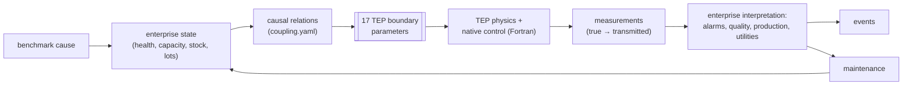
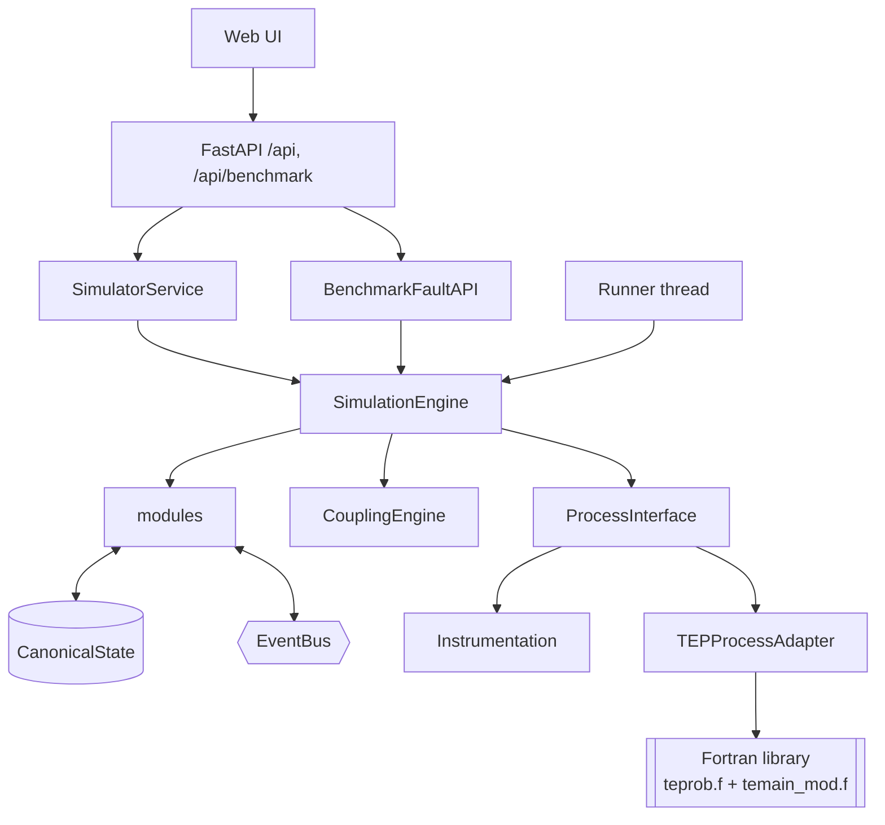

# Master simulator specification

**System:** ACME enterprise manufacturing simulator (Tennessee Eastman site). **Simulator version:**
1.0.0 (`simulator.__version__`). **Status of this document:** describes the implementation in this
repository. Where the implementation is incomplete or differs from earlier documentation, the text
says so. Detailed pages are linked from each section.

---

## 1. Executive summary

The simulator produces a deterministic, reproducible "manufacturing reality" for one site whose
chemical process is the **Tennessee Eastman Process (TEP)**. TEP is computed by the **original Fortran
code** (`teprob.f`, `temain_mod.f`), compiled unmodified and driven through ctypes. It includes its
native closed-loop control scheme.

Around it, an ISA-95-structured **enterprise layer** in Python simulates:
* equipment condition and redundancy;
* cooling water, steam and power;
* raw-material storage and lots, and a product warehouse;
* quality control, production orders and lots;
* maintenance with technicians and spare parts;
* alarms and operator actions.

A benchmark-only **fault engine** injects causes. The simulator computes consequences.

The enterprise layer can influence TEP only through **17 declared boundary parameters** of the Fortran
model. With a healthy plant the full simulator is **bit-identical** to bare TEP (tested). Everything is
exposed through a Python service, a REST API, a web UI and JSON/CSV exports. 83 automated tests pass.

The most important open issue is that **benchmark ground truth is not yet separated from operational
views**: fault control is, but causes remain inferable from several operational routes (§19,
[benchmark limitations](11_limitations/benchmark_limitations.md)).

## 2. Mental model

> **The enterprise simulator defines simulated manufacturing reality. Downstream information
> technologies may later expose views of that reality, but they do not define or modify it.**

See the [10-minute mental model](README.md#the-10-minute-mental-model).

## 3. Scope

| Currently implemented | Not implemented (by design or not yet) |
|---|---|
| **Process and control:** one site, one TEP; native control; plant and loop modes | UNS, MQTT, historian, knowledge graph, i3X, MCP, agent, LLM, vector DB, RAG |
| **Enterprise modules:** equipment, instrumentation, utilities, materials, inventory, warehouse, quality, production, scheduling, maintenance, alarms, operator | multiple sites; plant restart after a trip; persistence; authentication |
| **Coupling:** 67 relations and 17 boundary parameters | automatic preventive maintenance (only scenario-planned tasks) |
| **Faults:** 20 TEP-native + 14 enterprise types | an observable-only view for agents |
| **Interfaces:** Python service, REST API, web UI, exports | published-dataset validation |
| **Scenarios:** YAML/JSON | — |

Details: [goals and scope](01_overview/goals_and_scope.md), [future extensions](11_limitations/future_extensions.md).

## 4. Architecture

**Layers:**
* **TEP (Fortran):** process physics and native control.
* **Adapter:** calls TEP exactly as its main program would. No enterprise logic.
* **ProcessInterface:** the enterprise side's single, audited access to the adapter.
* **Modules:** own their state; communicate via the state, events and a command registry.
* **CanonicalState:** the truth store.
* **Service and API:** views and commands.
* **UI:** presentation only.

Details: [architecture](01_overview/architecture.md), [design principles](01_overview/design_principles.md).

## 5. Manufacturing hierarchy

ISA-95 (IEC 62264-1 / OPC 10030) role-based equipment hierarchy with validated containment:

* **Elements:** 87 in total (57 from the TEP flowsheet, 30 added by the enterprise layer): Enterprise
  (1), Site (1), Areas (8), Production Units (5), Equipment Modules (13), Control Modules (34), Storage
  Zones (3), Storage Units (9), Work Centers (4), Work Units (9).
* **TEP areas** use Production Units (continuous process). Utilities use Work Centers and Work Units.
  Control loops are Control Modules placed next to their valve or PV.
* **TEP variables are data on equipment,** never equipment.

Details: [ISA-95 model](02_manufacturing_model/isa95_model.md), [entity table](02_manufacturing_model/isa95_entity_table.md).

## 6. TEP integration

| Aspect | Specification |
|---|---|
| **Sources** | camaramm/jkitchin `teprob.f` + `temain_mod.f`, byte-identical; SHA-256 in the manifest ([provenance](03_tep/tep_version_and_provenance.md)) |
| **Build** | `-O2 -fno-fast-math -ffp-contract=off`; local gfortran or Docker; prebuilt Windows DLL included |
| **Initialisation** | zero all common blocks → TEINIT → seed G → native controller parameters from MAIN (single precision) |
| **Step** | due CONTRLn (3/360/900 s) on transmitted PVs → INTGTR (TEFUNC + Euler, 1 s) → CONSHAND |
| **Variables** | 41 XMEAS, 12 XMV, 20 IDV, 50 states ([measurements](03_tep/measurements.md), [MVs](03_tep/manipulated_variables.md), [disturbances](03_tep/disturbances.md)) |
| **Control** | 19 native loops; plant CLOSED_LOOP/MANUAL; loop AUTO/CAS/MAN; bumpless MAN→AUTO; wind-up preserved ([native control](03_tep/native_control.md)) |
| **Shutdown** | native interlock limits evaluated on `/TEPROC/`; the process freezes; no restart ([shutdown](03_tep/safety_and_shutdown.md)) |
| **Backends** | Fortran (authoritative); Python (development, statistically similar) |

## 7. Enterprise model

| Module | Represents | Owns | Key rule |
|---|---|---|---|
| [Equipment](02_manufacturing_model/equipment.md) | 10 assets | health, status, running, vibration | health = intrinsic − fault damage; wear; 30 s auto-changeover on failure |
| Instrumentation | transmitters | overlays, quality | bias/drift/dropout on transmitted values only |
| [Utilities](02_manufacturing_model/utilities.md) | CW ×2, steam, power | status, availability | quantities from relations; NORMAL/DEGRADED/CONSTRAINED/UNAVAILABLE |
| [Materials & inventory](02_manufacturing_model/materials_and_storage.md) | 4 feed storages, lots, POs, spares | stock, lots, supply availability | FIFO at true feed rates; reorder point; shortage → supply loss |
| Warehouse | product tanks, dispatch | lot locations, shipments | moves lots on QC decision |
| [Quality](02_manufacturing_model/quality.md) | product analyzer, lab | samples, lot disposition | tests on transmitted XMEAS 38-41; lot decision 900 s after close |
| [Production & scheduling](02_manufacturing_model/production.md) | TEP line, orders, lots | rate, lots, orders, OEE | metered XMEAS 17 × 613.4 kg/m³; single-line order sequencing |
| [Maintenance](02_manufacturing_model/maintenance.md) | work orders, technicians | WOs, technicians | alarm/failure → WO → response time → isolate/changeover → repair |
| Alarms | 105 definitions | alarm states | ISA-18.2 states, delays, deadband |
| Operator | HMI gateway | operator log | 12 actions; scriptable |

## 8. Coupling model

* **Declarative relations** `output = expression(inputs)` in `configs/coupling.yaml`: 61 definitions,
  67 after `for_each` expansion. Topologically sorted; cycles and double writers rejected; evaluated
  every second before TEP.
* **Categories:** equipment_performance (15), power_distribution (1), utility_supply (12),
  tep_boundary (15), utility_observation (24).
* **The TEP boundary contract** ([coupling contract](04_coupling/coupling_contract.md)): the enterprise
  layer writes **only** `VRNG(1,2,3,4,9,10,11)`, `CPFLMX`, `SZERO(1,2,5,6)` and `XST` feed impurities.
  Two declared parameters are uncoupled. Faults may also toggle IDV. Operators may write SETPT, modes
  and manual XMV. XMEAS is never written; transmitted values are swapped into `/PV/` only during
  controller calls.
* **Healthy = native,** by design margins and deviation-form lot couplings.

Details: [coupling architecture](04_coupling/coupling_architecture.md), [boundary variables](04_coupling/boundary_variables.md),
[relations](04_coupling/coupling_relations.md).

## 9. State model

`CanonicalState` holds:
* `entities` (96: 87 equipment, 4 utility services, 5 materials);
* the `process` image (true and transmitted XMEAS, quality, XMV, setpoints, loops, IDV, boundary,
  shutdown);
* 12 record collections;
* the causal registry;
* fault-effect channels;
* the production summary.

Variables are classified as measured, commanded, derived, simulated or constant, and each carries a
truth label: process truth, simulation truth, observation, interpretation or benchmark truth.
Ownership was observed by instrumentation.

Details: [canonical state](05_state_and_events/canonical_state.md), [state model](05_state_and_events/state_model.md),
[variable reference](05_state_and_events/variable_reference.md).

## 10. Event model

* **46 types.** Fields: `event_id` (`EV-`/`LC-`), `timestamp` (from sim time), `simulation_time`,
  `type`, `source`, `target`, `payload`, `correlation_id`, `causation_id`, `severity`, `visibility`.
* **The bus is synchronous and deterministic,** with a bounded ordered log.
* **Correlation** comes from explicit causes or from the causal registry, so it is ground truth.

Details: [event model](05_state_and_events/event_model.md), [lifecycle](05_state_and_events/event_lifecycle.md),
[catalog](05_state_and_events/event_catalog.md).

## 11. Variable graph

* **195 nodes and 258 edges** in 8 cause-to-effect columns, generated by
  `scripts/build_variable_graph.py`.
* **Only the 124 coupling edges are executed** by the simulator. The rest document TEP physics (57,
  of which 41 hand-curated), native control (38), module logic (35) and events (4).
* **Every edge has a semantic type:** capability constraint, supply dependency, TEP boundary interface,
  process response, control measurement/actuation/cascade, derivation, state transition, event trigger,
  cause injection.

Details: [graph model](07_variable_graph/graph_model.md), [edge types](07_variable_graph/edge_types.md),
[generation](07_variable_graph/graph_generation.md).

## 12. Scenario and fault model

* **Scenarios** (YAML/JSON): seed, duration, start, backend, control mode, config overrides, faults,
  orders, planned maintenance, operator actions.
* **Faults:**
  * `id, type, target, trigger (time | manual | event), severity 0-1, progression (step | gradual |
    intermittent), duration, parameters`;
  * observability and expected-effects metadata;
  * lifecycle CREATED → SCHEDULED → ACTIVE → STOPPED → RESET;
  * **persistent** types keep damage until repair;
  * repair remediates.
* **TEP-native** faults toggle IDV only. **Enterprise** faults write cause channels or sensor overlays.

Details: [scenario model](06_scenarios/scenario_model.md), [fault injection](06_scenarios/fault_injection.md),
[fault taxonomy](06_scenarios/fault_taxonomy.md), [causal chains](06_scenarios/causal_chains.md),
[worked demo](06_scenarios/scenario_examples/SCN-COOL-001.md).

## 13. Maintenance

**Triggers:**
* alarms configured with `maintenance:` (vibration → corrective; CW capacity → inspection);
* equipment failure (P1);
* scenario plan;
* operator.

**Execution:**
* one open WO per asset;
* response time by priority (P1 600 s … P4 14400 s, plus the delay fault);
* skill- and shift-based technician assignment;
* parts reserved, then issued.

**Effect:** corrective and planned work isolates the asset, with immediate changeover to a standby if
one exists. Completion restores health and clears fault damage. Inspections raise corrective orders for
under-performing running assets. Maintenance never acts on TEP directly.

## 14. Production

* **Rate** = transmitted XMEAS(17) × 613.4 kg/m³, and zero when tripped. The line state comes from a
  5-min average.
* **Lots:** hourly production lots.
* **Orders:** the state machine PLANNED → RELEASED → RUNNING ⇄ PAUSED → COMPLETED (plus BLOCKED and
  CANCELLED); single-line sequencing; material reservation; lateness projection; OEE.
* Production does not influence TEP.

## 15. Quality

* **Sampling:** on each product analyzer result, every 0.25 h.
* **Tests** on transmitted XMEAS 38-41: G mass % 47.5–52.5, G+H ≥ 95 mol %, E ≤ 1.2, F ≤ 0.2.
* **Lot assignment** uses the 900 s dead time. The lot is RELEASED at 0 % failing samples, QUARANTINE
  at ≤ 25 %, REJECTED above.
* **Raw-material lots** get incoming inspection 600 s after receipt.
* **The `quality_failure` fault** offsets reported values only.

## 16. Simulation lifecycle

* **Start-up:** `run.py` → build library if needed → `create_app` → `SimulationEngine._build`
  (validate, TEINIT, modules, baseline) → READY.
* **Step (1 s):** faults → operator → equipment → maintenance → inventory → scheduling → coupling → TEP
  → sync → [PROCESS_SHUTDOWN] → utilities → inventory → production → quality → warehouse → alarms →
  trends.
* **Control:** start/pause/resume/step/run_until/speed/reset.
* **Status:** READY → RUNNING ⇄ PAUSED → COMPLETED.
* **The real-time runner** only chooses how many steps to run per tick.

Details: [architecture](01_overview/architecture.md#3-simulation-step-lifecycle).

## 17. API

| Surface | Contents |
|---|---|
| Operational (`SimulatorService`, `/api/*`) | simulation control; enterprise, site, area, equipment and generic entity/property access; process measurements, setpoints, MVs, loops; alarms; events; utilities; maintenance; inventory; quality; production; coupling; trends; operator actions; scenarios; exports |
| Benchmark (`BenchmarkFaultAPI`, `/api/benchmark/*`) | fault catalog, create/schedule/start/stop/reset/status/list; ground truth |

There is no authentication. Errors: 400 validation, 404 unknown, 409 lifecycle.

Details: [API overview](08_api/api_overview.md), [simulation](08_api/simulation_api.md), [state](08_api/state_api.md),
[events](08_api/event_api.md), [benchmark](08_api/benchmark_api.md), [examples](08_api/examples.md).

## 18. Validation

**83/83 tests pass (≈ 55 s).** What they establish:
* TEP base case at t = 0 and in closed loop;
* **bit-identical healthy-enterprise vs native TEP;**
* determinism of the adapter, full runs and faults;
* mapping and ISA-95 validity;
* each enterprise module's rules;
* coupling propagation for pump, power and stock;
* the demo's causal chain;
* API separation of fault control;
* reset and exports.

**Not established:**
* published-dataset agreement and cross-platform equality;
* enterprise realism and magnitudes;
* several coupling paths and workflows;
* the UI in a browser.

Details: [validation strategy](09_validation/validation_strategy.md), [test catalog](09_validation/test_catalog.md).

## 19. Reproducibility

**Deterministic** means: identical `EV-` event log and bit-identical trajectories, given the same
compiled library, code, configuration, scenario and seed, and the same external commands at the same
simulation times.

**Recorded in the manifest:**
* run id;
* seed and TEP seed;
* backend;
* TEP source and library SHA-256;
* platform;
* simulator version;
* configuration hash;
* start and duration.

**Not recorded:** a code hash and the numpy version. **Not guaranteed:** cross-platform or cross-build
equality; Python-backend equality.

Details: [determinism](09_validation/determinism.md), [seeds and reproducibility](10_operation/seeds_and_reproducibility.md).

**Security and ground-truth separation.**
* **Enforced:** fault control and fault events are benchmark-only.
* **Not enforced:** correlation ids, health, boundary values, true measurements in history, lot
  deviations, exports and scenario files are reachable from operational routes (G1-G10).
* **No authentication.**

Details: [benchmark limitations](11_limitations/benchmark_limitations.md).

## 20. Limitations

Key items:
* ground-truth leakage (L1);
* no restart after a trip (L2);
* native wind-up (L3), preserved;
* uncalibrated enterprise models (L4);
* uncoupled equipment and parameters (L5);
* heuristic causal labels (L7);
* per-build reproducibility (L8);
* maintenance isolation of non-redundant assets (L10);
* the demo sits near a trip threshold (L15).

Details: [known limitations](11_limitations/known_limitations.md), [modelling assumptions](11_limitations/modeling_assumptions.md),
[TEP](11_limitations/tep_limitations.md), [coupling](11_limitations/coupling_limitations.md),
[gaps](11_limitations/documentation_gaps.md), [discrepancies](11_limitations/documentation_vs_implementation.md).

## 21. Extension model

| Extension | Mechanism |
|---|---|
| Equipment | `site.yaml` + `equipment.yaml` + relations |
| Utility | `utilities.yaml` + relations |
| Coupling | a `coupling.yaml` relation; new TEP influence only via a new `BoundaryParameter` |
| Fault type | `@register` a `FaultType` writing a cause channel; ensure a reader exists |
| Event type | `EventType` member + publisher |
| Scenario | YAML file |

Each is validated at start-up and checked by the tests plus `scripts/check_docs.py`. See the
[developer guide](12_developer_guide/adding_faults.md).

## 22. Current vs future architecture

* **Current:** Enterprise simulator → canonical state → REST/Python API → UI and exports.
* **Future** (not implemented): canonical state → UNS / historian / KG / live state → i3X → MCP →
  agent → evaluator.

The simulator remains independently runnable. **Before building those layers, define and enforce an
observable view** (§19). See [future extensions](11_limitations/future_extensions.md).
